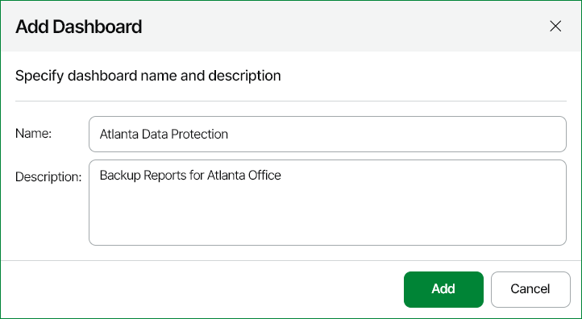

# Step 1. Create Dashboard

To create a new dashboard:

1. Open Veeam ONE Web Client.
2. Open the Dashboards section.
3. At the top left corner of the Dashboards section, click Add New.
4. In the Add dashboard window, specify dashboard settings:

* In the Name field, specify the name that will be displayed at the top of the dashboard.
* In the Description field, specify a brief dashboard description.

1. Click Add.

A new empty dashboard will be created and added to the Dashboards section.

Related Topics

[Setting Dashboard Preview Image and Color](set_preview_image_and_color.md)

