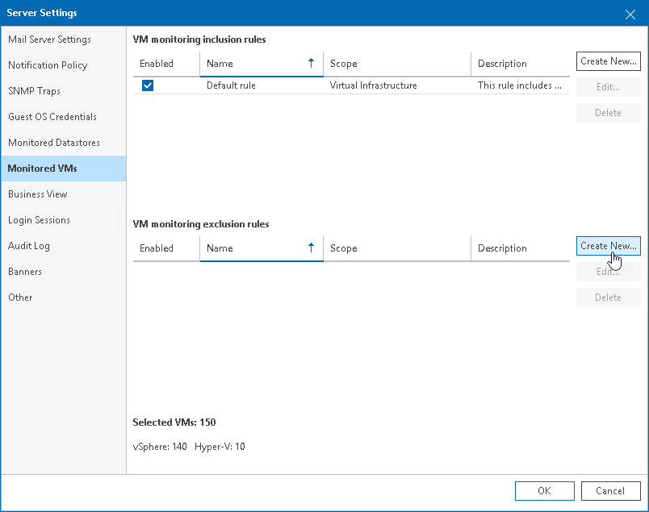
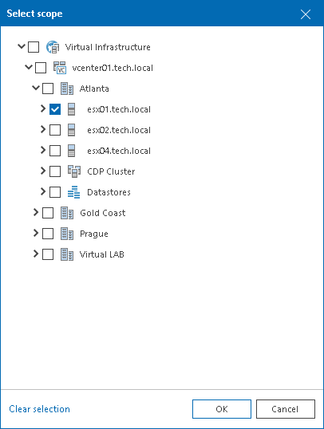
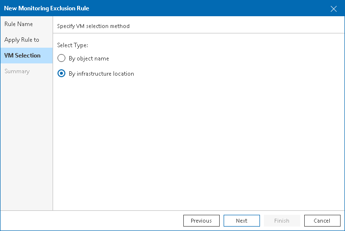

# How to Create Exclusion Rule and Add VMs by Location

You can create a rule to exclude from the data collection scope VMs residing on a specific host:

1. Open Veeam ONE Client.
2. In the main menu, click Settings and select Server Settings.

Alternatively, press the [CTRL+S] on the keyboard.

1. In the Server Settings window, open the Monitored VMs tab.
2. On the Monitored VMs tab, in the VM Monitoring Exclusion Rules section, click Create New.

1. At the Rule Name step of the Monitoring Rule wizard, type the rule name. In the Description field, type the rule description.
2. At the Apply Rule to step of the wizard, click Add and select Infrastructure View. In the Select scope window, select the check box next to the host that must be excluded from the data collection scope.

1. At the VM Selection step of the wizard, choose By infrastructure location.

1. At the Summary step of the wizard, review rule configuration and click Finish.

