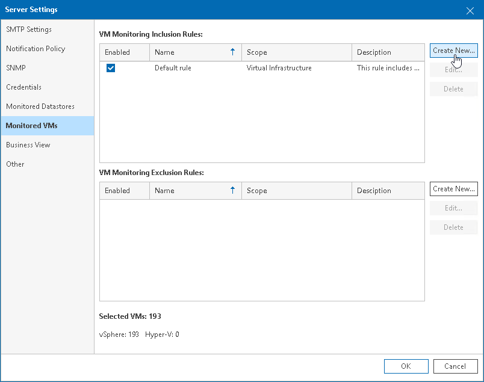
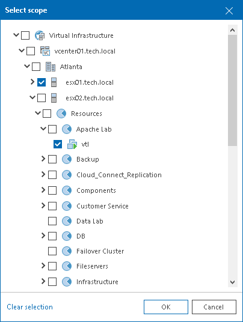
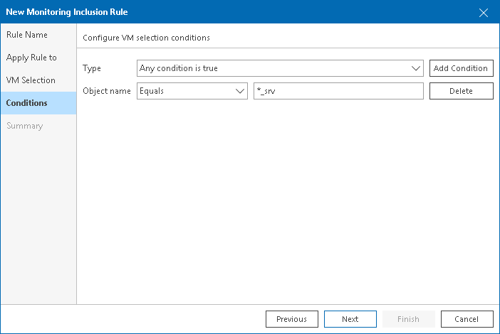

# How to Create Inclusion Rule and Add VMs by Name

You can create a rule to include VMs in the data collection scope VMs whose names end with '\_srv':

1. Open Veeam ONE Client.
2. In the main menu, click Settings and select Server Settings.

Alternatively, press the [CTRL+S] on the keyboard.

1. In the Server Settings window, open the Monitored VMs tab.
2. On the Monitored VMs tab, in the VM Monitoring Inclusion Rules section, click Create New.

1. At the Rule Name step of the Monitoring Rule wizard, type the rule name. In the Description field, type the rule description.
2. At the Apply Rule To step of the wizard, click Add and select Infrastructure View, Business View or VMware Cloud Director View. In the Select scope window, select check boxes next to containers to which the rule must apply.

1. At the VM Selection step of the wizard, choose By object name.
2. At the Conditions step of the wizard, perform the following steps:

1. Click Add Condition.
2. From the Object name list, select the Equals condition.
3. In the value field, type the '\*\_srv' query.

This will include in the data collection scope all VMs whose name ends with '\_srv'.

1. At the Summary step of the wizard, review rule configuration and click Finish.

