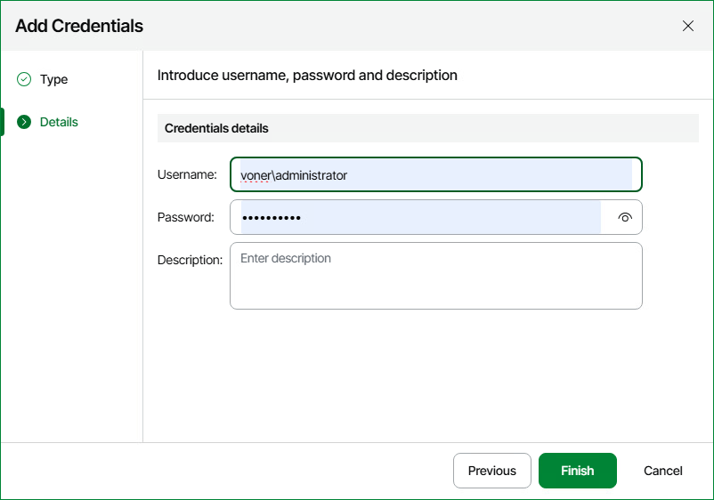
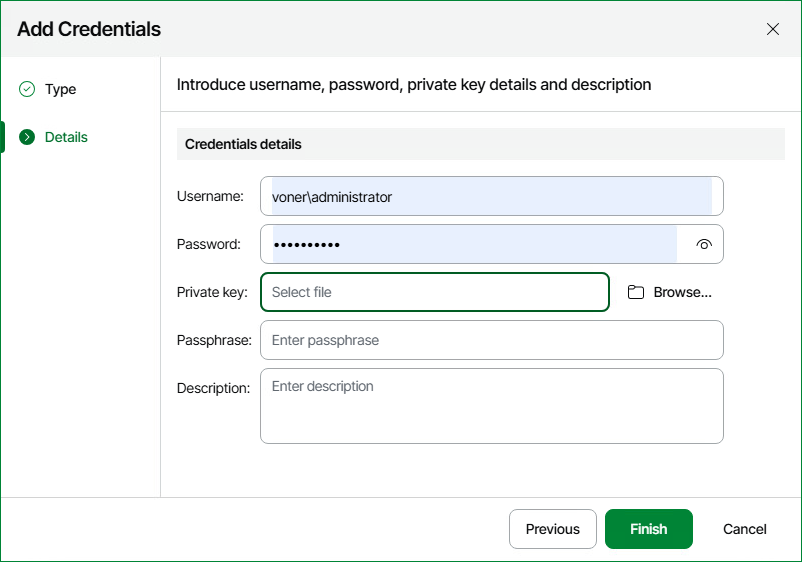
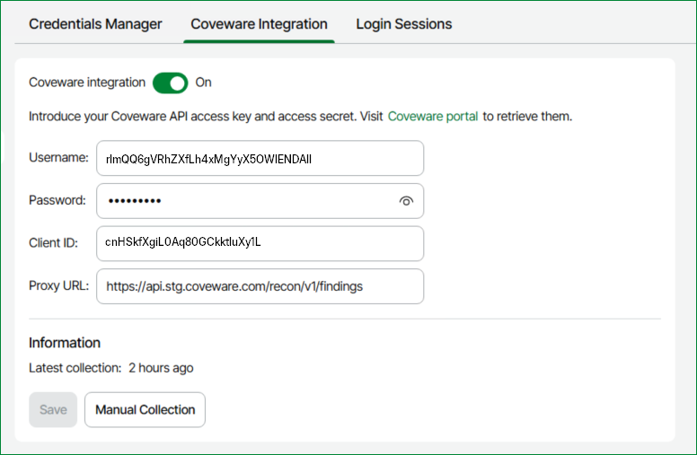

# Security

You can use the Security screen to create and maintain a list of credentials records that you plan to use to connect to components in the virtual and backup infrastructure, configure your integration with Recon for Veeam Infrastructure and adjust the login session settings to optimize the process of accessing Veeam ONE Web Client.

* [Credentials Manager](#credentials_manager)
* [Integration with Recon for Veeam Infrastructure](#coveware_integration)
* [Login Sessions](#login_sessions)

Credentials Manager

The Credentials Manager lets you create the following types of credentials records:

* Standard account
* Linux private key

Adding Standard Accounts

You can create a credentials record for an account that you plan to use to connect to infrastructure objects and their guest OS.

1. Open Veeam ONE Web Client.

For details, see [Accessing Veeam ONE Components](access.md).

1. At the top right corner of the Veeam ONE Web Client window, click Configuration.
2. In the configuration menu on the left, click Security.
3. Navigate to the Credentials Manager tab.
4. Click Add credentials.
5. At the Type step of the wizard, select Standard account.
6. At the Details step of the wizard:

1. In the Username field, enter a user name for the account that you want to add. You can also click Browse to select an existing user account.
2. In the Password field, enter a password for the account that you want to add. To view the entered password, click and hold the eye icon on the right of the field.
3. In the Description field, enter a description for the created credentials record.

As there can be a number of similar account names, for example, Administrator, it is recommended that you provide a meaningful unique description for the credentials record so that you can distinguish it in the list. The description is shown in brackets, following the user name.

1. Click Finish.

Adding Linux Private Keys

You can add a credentials record to connect to Linux machines using the Identity/Pubkey authentication method.

|  |
| --- |
| NOTE: |
| To use this method, you must first generate a pair of keys using a key generation utility, for example, ssh-keygen. Place the public key on a Linux server. To do this, add the public key to the authorized\_keys file in the .ssh/ directory in the home directory on the Linux machine. Place the private key in some folder on the Veeam ONE server or in a network shared folder. |

To create a new credentials record using the Identity/Pubkey authentication method:

1. Open Veeam ONE Web Client.

For details, see [Accessing Veeam ONE Components](access.md).

1. At the top right corner of the Veeam ONE Web Client window, click Configuration.
2. In the configuration menu on the left, click Security.
3. Navigate to the Credentials Manager tab.
4. Click Add credentials.
5. At the Type step of the wizard, select Linux private key.
6. At the Details step of the wizard:

1. In the Username field, specify a user name for the created credentials record.
2. In the Password field, specify the password for the user account.
3. Click Browse next to the Private key field to select a private key file.
4. In the Passphrase field, specify a passphrase for the private key on the backup server.
5. In the Description field, enter a description for the created credentials record.

As there can be a number of similar account names, for example, Root, it is recommended that you supply a meaningful unique description for the credentials record so that you can distinguish it in the list.

1. Click Finish.

Editing and Deleting Credentials Records

You can edit or delete credentials records that you have created.

1. Open Veeam ONE Web Client.

For details, see [Accessing Veeam ONE Components](access.md).

1. At the top right corner of the Veeam ONE Web Client window, click Configuration.
2. In the configuration menu on the left, click Security.
3. Navigate to the Credentials Manager tab.
4. Select the credentials record and click Edit credentials.
5. If the credentials record is already used for any component in the infrastructure, Veeam ONE will display a warning. Click Edit to confirm your intention.
6. Edit settings of the credentials record as required and click Finish.

To delete a credentials record:

1. Open Veeam ONE Web Client.

For details, see [Accessing Veeam ONE Components](access.md).

1. At the top right corner of the Veeam ONE Web Client window, click Configuration.
2. In the configuration menu on the left, click Security.
3. Navigate to the Credentials Manager tab.
4. Select the credentials record and click Delete credentials.

If the credentials record is already used for any component in the infrastructure, Veeam ONE will display a warning. In this case, you need to connect to an infrastructure object with new credentials before deleting current credentials record.

Adding Credentials in Veeam ONE Client

Alternatively you can create credential records in Veeam ONE Client.

To create a new standard credentials record:

1. Open Veeam ONE Web Client.

For details, see [Accessing Veeam ONE Components](access.md).

1. In the main menu, click Credentials Manager.

Alternatively, press [CTRL + M] on the keyboard.

1. Click Add > Standard account.
2. In the Username field, enter a user name for the account that you want to add. You can also click Browse to select an existing user account.
3. In the Password field, enter a password for the account that you want to add. To view the entered password, click and hold the eye icon on the right of the field.
4. In the Description field, enter a description for the created credentials record.

As there can be a number of similar account names, for example, Administrator, it is recommended that you provide a meaningful unique description for the credentials record so that you can distinguish it in the list. The description is shown in brackets, following the user name.

1. Click Save.

Adding Linux Private Keys in Veeam ONE Client

You can add a credentials record to connect to Linux machines using the Identity/Pubkey authentication method.

|  |
| --- |
| NOTE: |
| To use this method, you must first generate a pair of keys using a key generation utility, for example, ssh-keygen. Place the public key on a Linux server. To do this, add the public key to the authorized\_keys file in the .ssh/ directory in the home directory on the Linux machine. Place the private key in some folder on the Veeam ONE server or in a network shared folder. |

To create a new credentials record using the Identity/Pubkey authentication method:

1. Open Veeam ONE Client.

For details, see [Accessing Veeam ONE Components](access.md).

1. In the main menu, click Credentials Manager.

Alternatively, press [CTRL + M] on the keyboard.

1. Click Add > Linux private key.
2. In the Username field, specify a user name for the created credentials record.
3. In the Password field, specify the password for the user account.
4. Click Browse next to the Private key field to select a private key file.
5. In the Passphrase field, specify a passphrase for the private key on the backup server.
6. In the Description field, enter a description for the created credentials record.

As there can be a number of similar account names, for example, Root, it is recommended that you supply a meaningful unique description for the credentials record so that you can distinguish it in the list.

1. Click Save.

Editing and Deleting Credentials Records on Veeam ONE Client

You can edit or delete credentials records that you have created.

To edit a credentials record:

1. Open Veeam ONE Client.

For details, see [Accessing Veeam ONE Components](access.md).

1. In the main menu, click Credentials Manager.

Alternatively, press [CTRL + M] on the keyboard.

1. Select the credentials record in the list and click Edit.
2. If the credentials record is already used for any component in the infrastructure, Veeam ONE will display a warning. Click Edit to confirm your intention.
3. Edit settings of the credentials record as required and click Save.

To delete a credentials record:

1. Open Veeam ONE Client.

For details, see [Accessing Veeam ONE Components](access.md).

1. In the main menu, click Credentials Manager.

Alternatively, press [CTRL + M] on the keyboard.

1. Select the credentials record in the list and click Delete.

If the credentials record is already used for any component in the infrastructure, Veeam ONE will display a warning. In this case, you need to connect to an infrastructure object with new credentials before deleting current credentials record.

Integration with Recon for Veeam Infrastructure

You can optionally integrate Recon for Veeam Infrastructure into Veeam ONE to provide the following information:

* Suspicious ransomware activities detected by Recon and displayed in the Threat Center dashboard.
* Internal alarms triggered by Recon and displayed in the Alarms Overview dashboard.

For more information on the solution, see [Recon for Veeam Infrastructure User Guide](https://helpcenter.veeam.com/docs/coveware/userguide/overview.html).

To configure integration with Recon for Veeam Infrastructure:

1. Open Veeam ONE Web Client.

For details, see [Accessing Veeam ONE Components](access.md).

1. At the top right corner of the Veeam ONE Web Client window, click Configuration.
2. In the configuration menu on the left, click Security.
3. In the main menu, navigate to the Coveware Integration tab.
4. Switch the Coveware integration toggle to On.
5. Specify parameters to connect to the Recon REST API:

* Username
* Password
* Client ID
* Proxy URL

To get these parameters, log in to the Coveware portal and enable API integration. For more information, see [Integrations](https://helpcenter.veeam.com/docs/coveware/userguide/overview.html#integrations) in the Recon for Veeam Infrastructure User Guide.

1. Click Save.
2. (Optional) To manually collect data from your Coveware instance, click Manual Collection.

Login Sessions

You can adjust the login session settings to optimize the process of accessing Veeam ONE Web Client. To do that:

1. Open Veeam ONE Web Client.
2. At the top right corner of the Veeam ONE Web Client window, click Configuration.
3. In the configuration menu on the left, click Security.
4. Navigate to the Login Sessions tab.
5. Specify login session settings:

* In the Idle user login session timeout, minutes, specify the time period in minutes after which an idle user must be automatically logged out.
* In the Idle administrator login session timeout, minutes, specify the time period in minutes after which an idle administrator must be automatically logged out.
* In the Maximum number of concurrent login sessions per user, specify the maximum allowed number of simultaneously processed login attempts performed by a single user.
* To view information on previous login sessions, select the Show previous login attempts after logging in check box. The information will be displayed on an additional page that opens after you log in.

1. Click Save.

