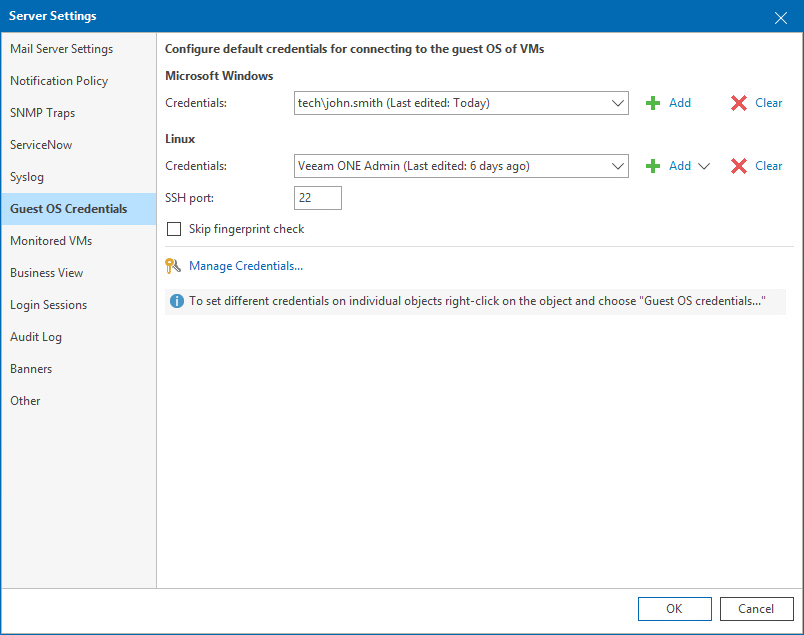

# Guest OS Credentials

In guest OS credentials settings, you can set an account that will be used to collect data from the guest OS of Windows and Linux-based VMs.

To access Guest OS Credentials settings:

1. Open Veeam ONE Client.

For details, see [Accessing Veeam ONE Components](access.md).

1. In the main menu, click Settings > Server Settings.

Alternatively, press [CTRL + S] on the keyboard.

1. In the Server Settings window, open the Guest OS Credentials tab.
2. Specify guest OS credentials:

1. In the Microsoft Windows section, select credentials of an account that will be used to collect data from the guest OS of Windows-based VMs. To create a new credentials record, click Add.
2. In the Linux section, select credentials of an account that will be used to collect data from the guest OS of Linux-based VMs. To create a new credentials record, click Add and select Standard account or Linux private key.

In the SSH Port field, change the default connection port if required.

To disable fingerprint validation for Linux VMs, select Skip fingerprint check.

To access credentials manager, click the Manage Credentials link. For details on working with credentials, see [Security](credentials_manager.md).

|  |
| --- |
| Tip: |
| You can set guest OS credentials on individual VMs. To do this, right-click a VM and choose Guest OS Credentials from the shortcut menu. |

Page updated 2026-08-03

