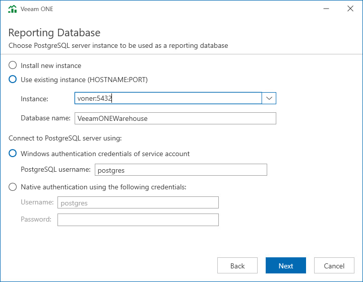

# Step 10. Choose Reporting Database

At the Reporting Database step of the wizard, choose a PostgreSQL Server instance that will host the Veeam ONE reporting database.

The reporting database is a dedicated database that stores PostgreSQL logs and metrics related to system activities, performance, and other relevant data for analysis and reporting purposes.

* If you do not have a PostgreSQL instance that you can use for Veeam ONE database, select the Install new instance option.

If this option is selected, the setup will install PostgreSQL locally, on the computer where you are installing Veeam ONE.

* If you want to use an existing local or remote PostgreSQL instance, select the Use existing instance option and enter the instance and database name.

* In the Connect to PostgreSQL server using section, select an authentication mode to connect to the database server instance: Microsoft Windows authentication or native database server authentication. If you select the native authentication, enter credentials of the PostgreSQL database account.

|  |
| --- |
| Note |
| Starting with Veeam ONE version 13, a PostgreSQL instance is required in addition to the primary Microsoft SQL Server instance. You can use an existing PostgreSQL instance that meets the Veeam ONE system requirements or install a new instance. |

