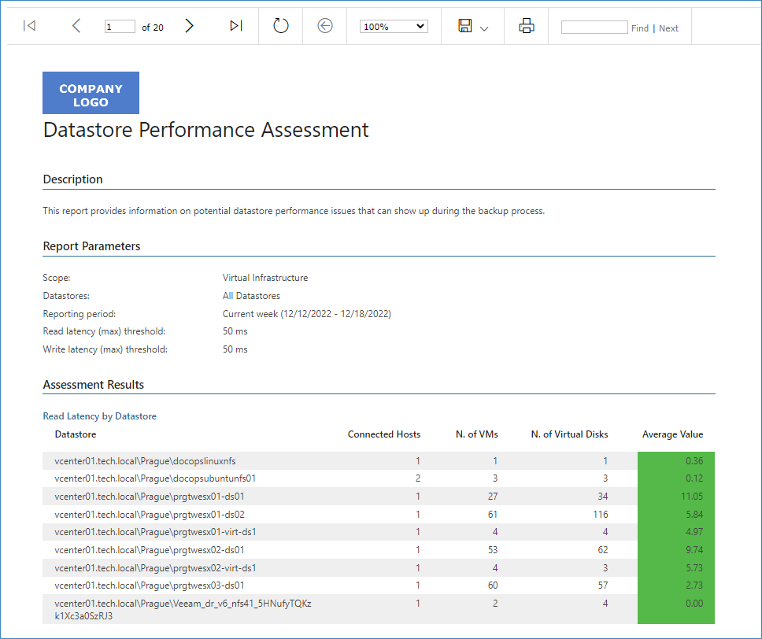
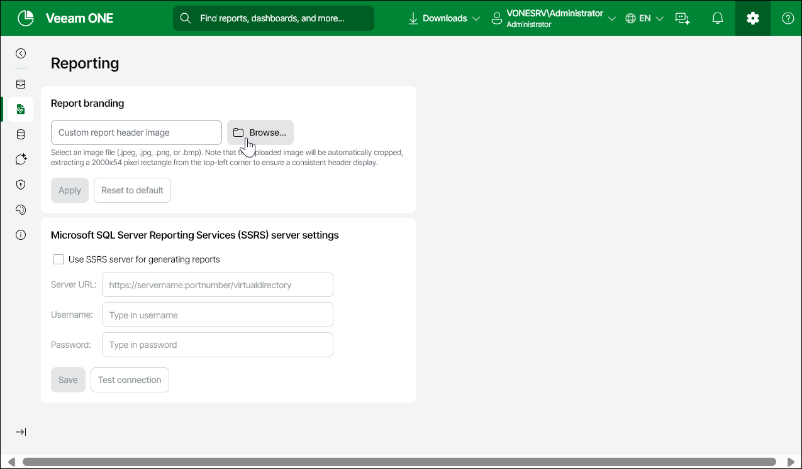

# Customizing Report Branding

To customize appearance of reports according to your company branding, you can replace the default report header with a custom image, such as your company logo.

Branding applies to both legacy reports and reports generated by Veeam ONE version 13's the new report engine. Custom branding for these reports is only visible in scheduled or downloaded PDF reports.

Image Requirements

Before creating an image that will replace the default report header, make sure that the image file is saved in the PNG, JPEG, JPG or BMP formats.

Replacing Default Report Header

To replace the default report header with a custom image:

1. Open Veeam ONE Web Client.
2. At the top right corner of the Veeam ONE Web Client window, click Configuration.
3. In the configuration menu on the left, click Reporting.
4. In the Report branding section, click Browse and specify path to the custom report image file.
5. Click Apply.

Restoring the Default Report Header

To restore the default report header:

1. Open Veeam ONE Web Client.
2. At the top right corner of the Veeam ONE Web Client window, click Configuration.
3. In the configuration menu on the left, click Reporting.
4. In the Report branding section, click Reset to Default.
5. In the Reset Report Header Image window, click Reset.

