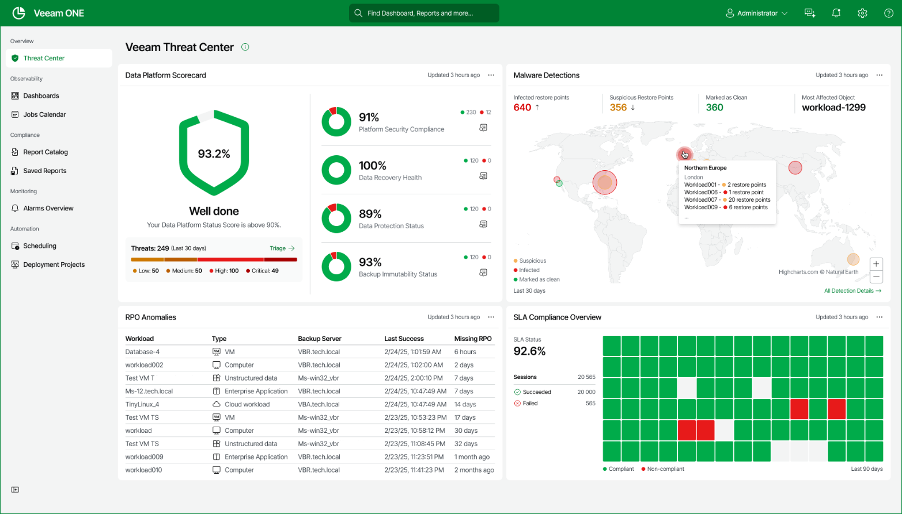

# Veeam Threat Center

The Veeam Threat Center dashboard displays Veeam Backup & Replication infrastructure security state and helps you assess the overall security and compliance of your infrastructure objects.

Veeam Threat Center provides all the required data protection visibility at a glance, allowing you to quickly and easily access all the threats, best practices and SLA data you need to operate securely and safely.

Widgets Included

Data Platform Scorecard

This widget summarizes and displays data platform scores for Platform Security Compliance, Data Recovery Health, Data Protection Status and Backup Immutability Status. This display provides all the required data protection visibility at a glance, allowing you to quickly and easily identify the information you need to action solutions to threats to your backup infrastructure.

You can configure the information displayed in the scorecard in the settings panel. You can edit the scorecard widget to display information on infrastructure objects as well as Data Recovery Health, Data Protection Status, Backup Immutability Status and Platform Security Compliance mini-widgets.

You can also configure and generate reports directly from the Platform Security Compliance, Data Protection Status and Backup Immutability Status and Data Recovery Health mini-widgets. Click the relevant report icon to the right of each section. For details on predefined Veeam ONE reports, see [Predefined Veeam ONE Reports](predefined_reports.md).

If you have configured integration with Coveware, the Data Platform Scorecard widget contains a Threats mini-widget that displays the number of potentially detected malware incidents depending on detected severity (low, medium, high, critical). To review incidents in the Coveware portal, click Triage. For details on Coveware integration, see [Security](credentials_manager.md#coveware_integration).

|  |
| --- |
| Note: |
| * To analyze data about protected VMs in the Data Protection Status mini-widget, you must connect the target virtualization servers to Veeam ONE. For details on, see [Adding Data Source](connecting_servers.md). * This widget inherits exclusions along with virtualization servers. Virtual Machines are hidden if they are excluded from the Monitoring Rules set in Veeam ONE Client. |

To configure the Data Platform Scorecard widget:

1. Open Veeam ONE Web Client.

1. Navigate to the Veeam Threat Center section.

1. At the top right corner of the Data Platform Scorecard widget, click the settings icon.

1. In the Platform Security Compliance step:

* Infrastructure objects — Select the infrastructure objects you want to include in the mini-widget scope.

* Include suppressed — Click the Include suppressed check box to include suppressed best practices objects in the mini-widget scope.

1. In the Data Recovery Health step:

* Infrastructure objects — Select the infrastructure objects you want to include in the mini-widget scope.

1. In the Data Protection Status step:

* Infrastructure objects — Select the infrastructure objects you want to include in the mini-widget scope.

* Protected workload types — Select the protected workload types that you want to include in the mini-widget scope: Virtual machines, Computers, Unstructured data, Cloud instances and Enterprise applications.

* RPO — Define the Recovery Point Objective period.

* Workload exclusion rule — Specify a list of workloads that should be excluded from the widget scope. You can enter workload names explicitly or create a wildcard mask by using the asterisk (\*) to replace any number of characters or question mark (?) to replace a single character. Multiple entries are separated by semicolon. Usage example: the following string will exclude workloads with the \_R&D suffix from appearing in the widget: \*\_R&D.

1. In the Backup Immutability Status step:

* Scope — Click the corresponding option button to switch between Business View and Infrastructure objects.

* Protected workload types — Select the protected workload types that you want to include in the mini-widget scope: Virtual machines, Computers, Unstructured data, Cloud instances and Enterprise applications.

* Job types — Select the job types to display on mini-widget.

* Threshold analysis — To set immutability thresholds, click the Use these immutability thresholds for analysis check box and define the immutability period and the number of immutable restore points.

1. Click Finish to save the changes.

Malware Detections

This widget shows malware detections by geographic location based on infection severity and infection suspicion. It also displays clean restore points and most affected objects. You can configure the time range to display malware detection over your desired defined time period.

The Malware Detections widget displays only detections in the defined time period and does not display any backup that has received no detection.

To configure a Malware Detections widget:

1. Open Veeam ONE Web Client.
2. Open the Veeam Threat Center section.
3. At the top right corner of the Malware Detections widget, click the settings icon.
4. In the Settings step:

* Infrastructure objects — Select the objects you want to include in the widget scope.
* Period — Define the time period in which detected malware is displayed.
* Show most affected — Define the most affected types of objects to display including backup repositories, backup servers or locations.

1. Click Assign Location in the Location tab to add location to each your backup repositories.

1. Select the required backup repository check boxes and click Assign location to assign a location to several objects. You can also assign a location to individual backup repositories. To do this click on the entry in the location column. If currently unassigned this displays as Unselected.

Additionally to create your own custom locations click Add custom location to define city, sub-region, region and geographic co-ordinates to display on the malware map.

1. Click Finish to save the changes.

Recovery Point Objective (RPO) Anomalies

This widget shows all objects in your infrastructure that have missed their defined RPO period. You can configure the widget settings to display your desired backup infrastructure objects, protected workload types, time period to display RPOs and Top N workloads.

|  |
| --- |
| Note: |
| * To analyze data about protected VMs in the RPO Anomalies widget, you must connect the target virtualization servers to Veeam ONE. For details on, see [Adding Data Source](connecting_servers.md). * This widget inherits exclusions along with virtualization servers. Virtual machines are also hidden if they are excluded by Monitoring Rules in Veeam ONE Client and have no restore points. |

To configure the RPO Anomalies widget:

1. Open Veeam ONE Web Client.
2. Open the Veeam Threat Center section.
3. At the top right corner of the RPO Anomalies widget, click the settings icon.
4. In the Edit Widget wizard, change the widget settings:

* Infrastructure objects — Select the infrastructure objects you want to include in the widget scope.

* Protected workload types — Select the protected workload types to monitor including Virtual machines, Computers, Unstructured data, Cloud instances and Enterprise applications.
* RPO — Define the Recovery Point Objective period.
* Top N workloads — Define the number of workloads to display on the widget.
* Workload exclusion rule — Specify a list of workloads that should be excluded from the widget scope. You can enter workload names explicitly or create a wildcard mask by using the asterisk (\*) to replace any number of characters or question mark (?) to replace a single character. Multiple entries are separated by semicolon. Usage example: the following string will exclude workloads with the \_R&D suffix from appearing in the widget: \*\_R&D.

1. Click Finish to save the changes.

SLA Compliance Overview

This widget displays a heatmap for your SLA success compliance allowing you to deep dive into success percentages over a defined time period. You can configure the widget settings to display infrastructure objects, job types, SLA period and SLA percentage threshold.

To configure the SLA Compliance Overview widget:

1. Open Veeam ONE Web Client.
2. Open the Veeam Threat Center section.
3. At the top right corner of the SLA Compliance Overview widget, click the settings icon.
4. In the Edit Widget wizard, change the widget settings:

* Infrastructure objects — Select the infrastructure objects you want to include in the widget scope.
* Job types — Select the job types to display on your widget.
* Period — Define the time period in which SLA data is displayed.

* Target SLA — Define the service level agreement threshold in percentage.

1. Click Finish to save the changes.

Page updated 2026-08-03

