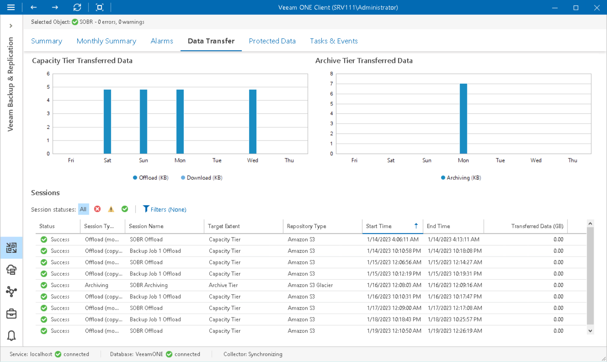

# Data Transfer

The Data Transfer dashboard provides detailed information on data transfer sessions for the chosen scale-out backup repository and helps to monitor the amount of data transferred between the repository extents.

To view data transfer details for a specific repository:

1. Open Veeam ONE Client.

For details, see [Accessing Veeam ONE Components](access.md).

1. In the inventory pane, click Veeam Backup & Replication.
2. In the inventory pane, select the necessary scale-out backup repository.
3. Open the Data Transfer tab.

Capacity Tier Transferred Data

The chart shows the amount of data transferred during capacity tier offload and download sessions.

Archive Tier Transferred Data

The chart shows the amount of data transferred during archive tier data transfer sessions.

Sessions

The list of sessions shows all types of data transfer sessions for the scale-out backup repository that you selected in the inventory pane. Each session in the list is described with a set of properties. To show or hide properties, right-click the list header and choose properties that must be displayed. To quickly find the necessary session, use the session status and session type filters at the top of the list.

* Status — latest status of the data transfer session (Success, Warning, Failed).
* Session Type — type of the data transfer session (Offload (copy policy), Offload (move policy), Download, Archiving, Retrieval).
* Session Name — name of the data transfer session.
* Target Extent — type of extent to which data transfer session is targeted (Archive Tier, Capacity Tier).
* Repository Type — type of the object storage repository used as the scale-out backup repository tier.
* Start Time — date and time when the data transfer session started.
* End Time — date and time when the data transfer session completed.
* Transferred Data (GB) — amount of data transferred between the tiers during the session.

