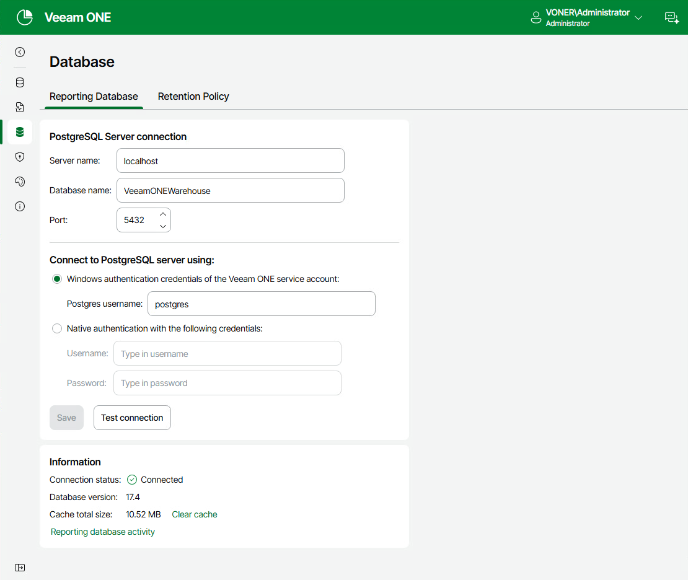
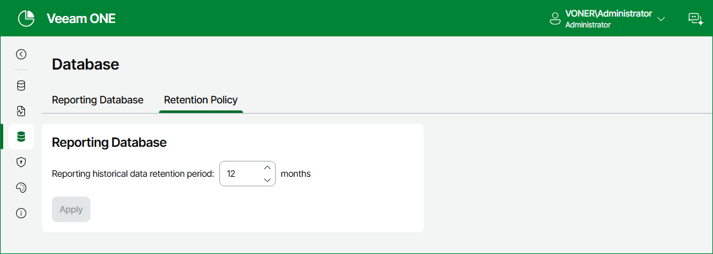

# Database

The reporting database is a dedicated PostgreSQL database that stores cached data for efficient retrieval and display in Veeam ONE reports.

PostgreSQL server connection is configured during installation, but you can edit and configure your PostgreSQL server connection to Veeam ONE after installation.

To do that:

1. Open Veeam ONE Web Client.
2. At the top right corner of the Veeam ONE Web Client window, click Configuration.
3. In the configuration menu on the left, click Database.
4. On the Reporting Database tab, specify the database settings:

* In the Server name field, specify the hostname or IP address of the PostgreSQL server that hosts the Veeam ONE reporting database.
* In the Database name field, specify the name of the database that stores the Veeam ONE reporting data you wish to connect to.
* In the Port field, specify the port number used for the PostgreSQL connection. The default number is 5432.

1. In the Connect to PostgreSQL server using section, select an authentication mode to connect to the database server instance: Microsoft Windows authentication or native database server authentication. If you select the native authentication, enter credentials of the PostgreSQL database account.
2. (Optional) Click Test connection to test whether your configured settings are correct. The Information section displays details of your connection.
3. (Optional) Click Reporting database activity to display the audit logs of your PostgreSQL connection including connection status, name and associated run time information.
4. (Optional) Click Clear cache if you encounter issues with report data or if any issue is affecting PostgreSQL as the first step when troubleshooting connections.
5. Click Save to save your configuration settings.

Retention Policy

On the Retention Policy tab, you can modify the time period during which reporting historical data is stored in the Veeam ONE reporting database. By default, reporting data is retained for 12 months.

To modify the retention period:

1. Navigate to the Retention Policy tab.
2. Define Reporting historical data retention period (in months).

1. Click Apply.

