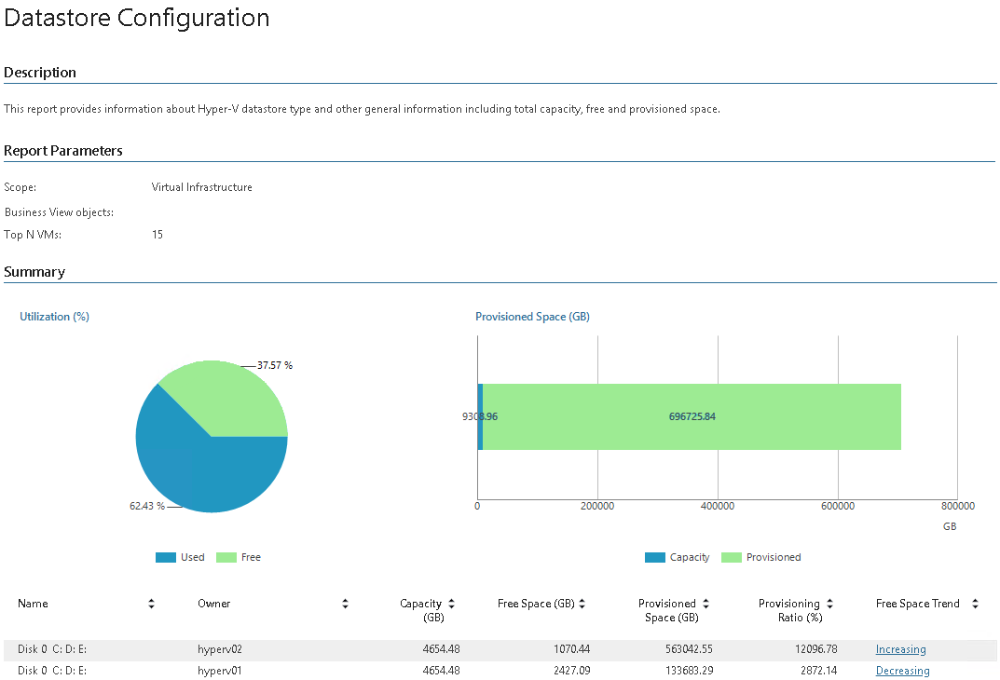

# Datastore Configuration (Hyper-V)

This report documents the current configuration of CSVs, SMB shares and local disks in your infrastructure.

* The Summary section includes the following elements:

+ The Utilization (%) chart shows the percentage of used and free space on all datastores.
+ The Provisioned Space (GB) chart shows datastore capacity and the amount of provisioned space.
+ The summary table provides information on each volume, including owner name, total capacity, free and provisioned space, provisioning ratio and free space utilization trend.

Click a link in the Free Space Trend column to drill down to daily information on total capacity, the amount of used and provisioned space, and the number of VMs that store data on the CSV/SMB share/local disk.

* The Top N VMs section provides information on top space consuming VMs, including VM name, number of disks and the amount of used space.

Report Parameters

You can specify the following report parameters:

* Infrastructure objects: defines a virtual infrastructure level and its sub-components to analyze in the report.
* Business View objects: defines Business View groups to analyze in the report. The parameter options are limited to objects of the Storage type.

Business View groups from the same category are joined using Boolean OR operator, Business View groups from different categories are joined using Boolean AND operator. That is, if you select groups from the same category, the report will contain all objects that are included in groups. However, if you select groups from different categories, the report will contain only objects that are included in all selected groups.

* Top N VMs: defines the number of top virtual machines that will be displayed in the report charts.

Use Case

The report helps you monitor storage capacities to ensure your VMs have sufficient room to operate.

