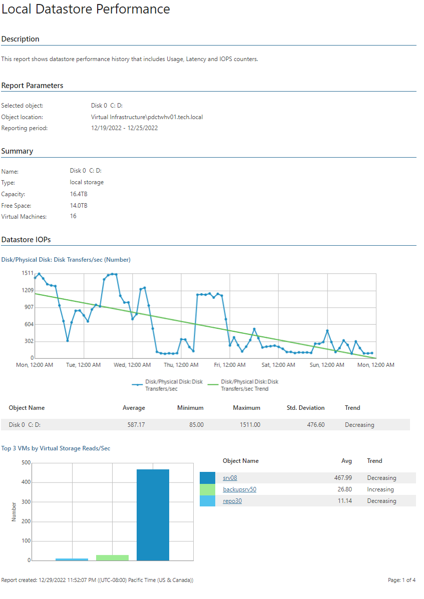

# Local Datastore Performance

This report aggregates historical data and shows performance statistics for a selected local disk across a time range.

* The Datastore subsections provide information on read/write rates, read/write latency and IOPS for the disk, including top 3 resource consuming VMs and resource usage trends.

Click a VM name in the list of top 3 resource consuming VMs to drill down to performance charts with statistics on CPU, memory, disk and network usage for the VM.

Report Parameters

You can specify the following report parameters:

* Object: defines the local disk to analyze in the report.
* Period: defines the time period to analyze in the report. Note that the reporting period must include at least one successfully completed Object properties data collection task for the selected disk. Otherwise, the report will contain no data.
* Business hours only: defines time of a day for which historical performance data will be used to calculate the performance trend. All data beyond this interval will be excluded from the baseline used for data analysis.

Use Case

The report helps you identify local disks with performance issues.

Page updated 2026-07-29

