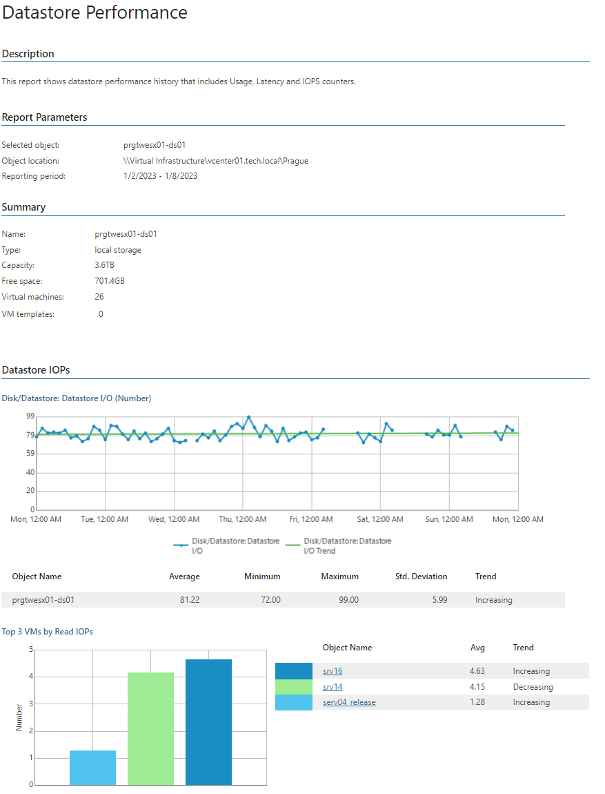
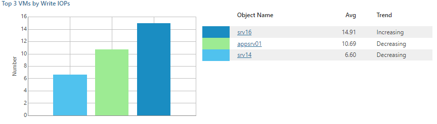

# Datastore Performance

This report aggregates historical data and shows performance statistics for a selected datastore across a time range.

* The Summary subsection provides information on type, capacity, free space, number of VMs and VM templates.
* The Datastore IOPs, Datastore Usage, Datastore Latency and Datastore Errors subsections provide information on IOPs, read/write rates, read/write latency and errors for the disk, including top 3 resource consuming VMs and resource usage trends.

Click a VM name in the list of top 3 resource consuming VMs to drill down to performance charts with statistics on CPU, memory, disk and network usage for the VM.

Report Parameters

You can specify the following report parameters:

* Object: defines the datastore to analyze in the report.
* Period: defines the time period to analyze in the report. Note that the reporting period must include at least one successfully completed Object properties data collection task for the selected datastore. Otherwise, the report will contain no data.
* Business hours only: defines time of a day for which historical performance data will be used to calculate the performance trend. All data beyond this interval will be excluded from the baseline used for data analysis.

Use Case

The report helps you assess current load on your datastores and identify performance issues, such as excessive bus resets or high command aborts rates.

Page updated 2026-07-29

