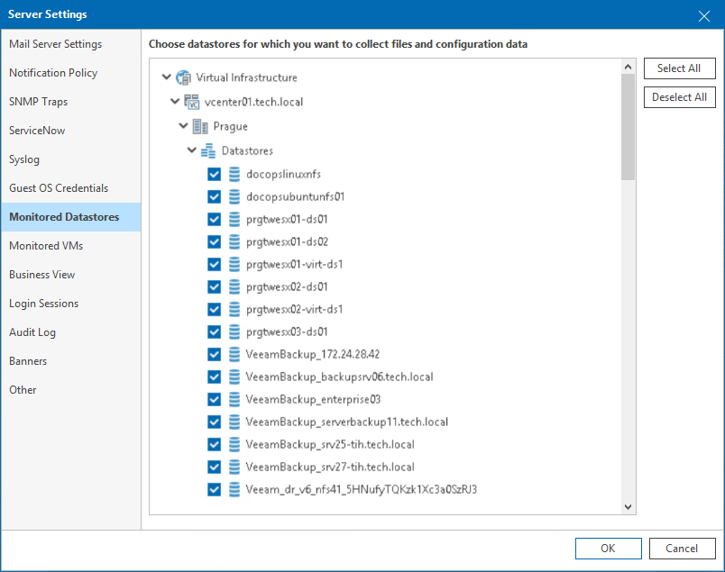

# Monitored Datastores

You can manage the list of datastores that must be included in the reporting scope:

1. Open Veeam ONE Client.

For details, see [Accessing Veeam ONE Components](access.md).

1. In the main menu, click Settings > Server Settings.

Alternatively, press [CTRL + S] on the keyboard.

1. In the Server Settings window, open the Monitored Datastores tab.
2. Expand the virtual infrastructure tree and select check boxes next to datastores that you want to include in reporting.

For details on choosing datastores to report on, see [Choosing Datastores to Report On](datastores_to_report.md).

