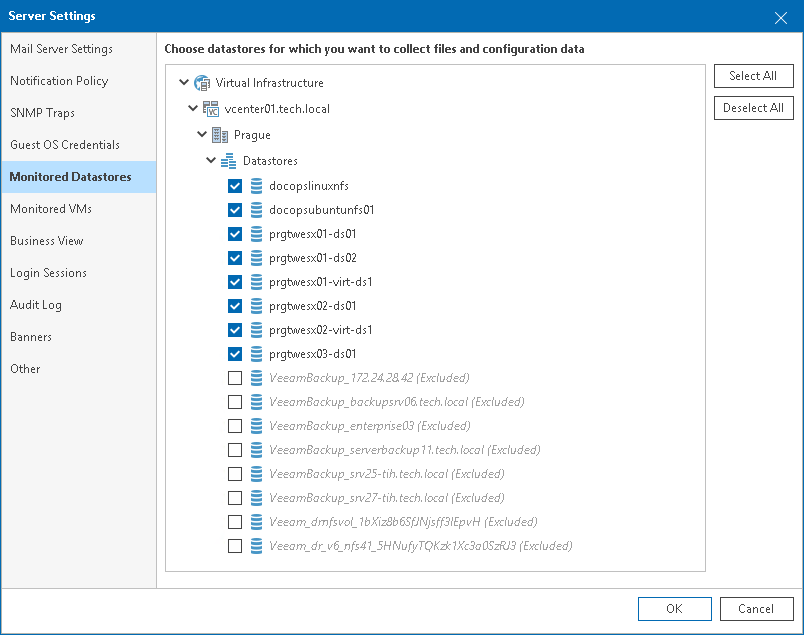

# Choosing Datastores to Report On

After you connect a VMware vSphere server in Veeam ONE Client, all datastores attached to this server are added to the data collection scope. If you do not need to collect data about specific datastores (for example, local datastores or datastores with ISO images), you can exclude these datastores from the collection scope.

Excluding datastores will accelerate completion of a data collection sessions. Excluded datastores will not be reflected in reports that analyze and list the files residing on datastores (such as the Garbage Files and Idle Templates reports).

|  |
| --- |
| Important! |
| Excluding datastores available for the VMware vSphere platform only. |

To exclude one or more datastores from the data collection scope:

1. Open Veeam ONE Client.
2. In the main menu, click Settings and select Server Settings.

Alternatively, press the [CTRL+S] on the keyboard.

1. In the Server Settings window, open the Monitored Datastores tab.
2. Expand the virtual infrastructure hierarchy and clear check boxes next to datastores that must be excluded from the data collection scope.
3. Click OK to apply changes.

