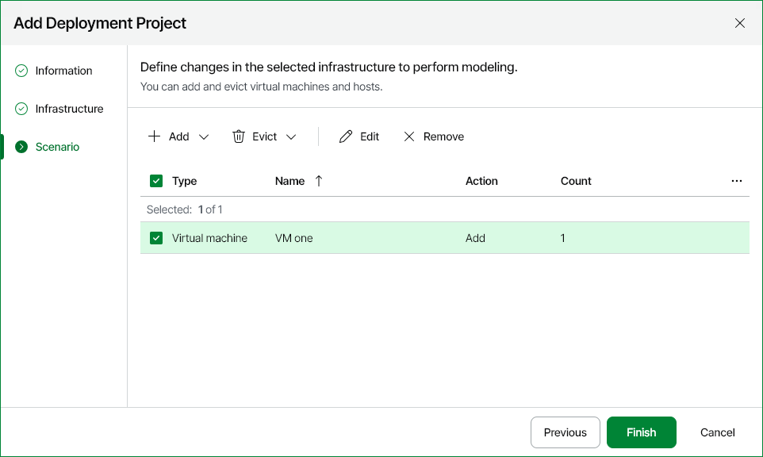
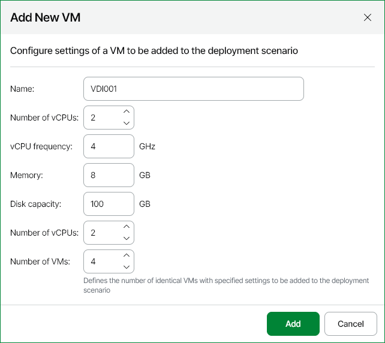
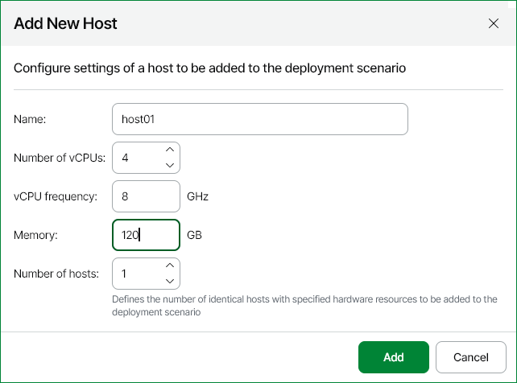
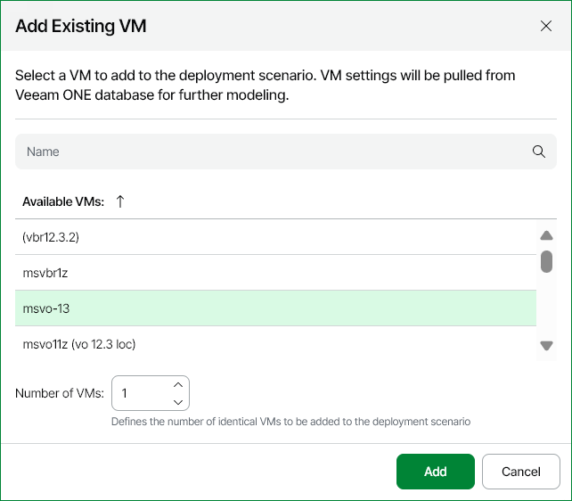
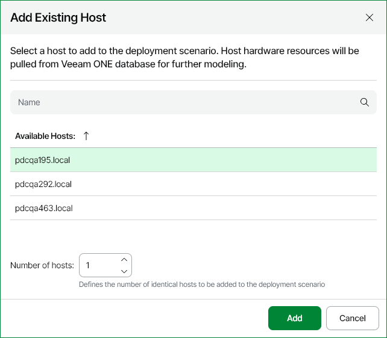
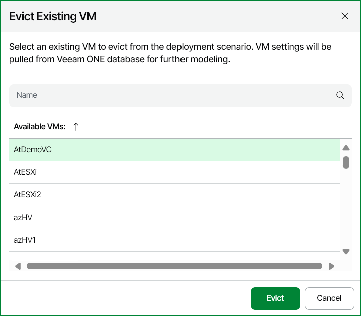
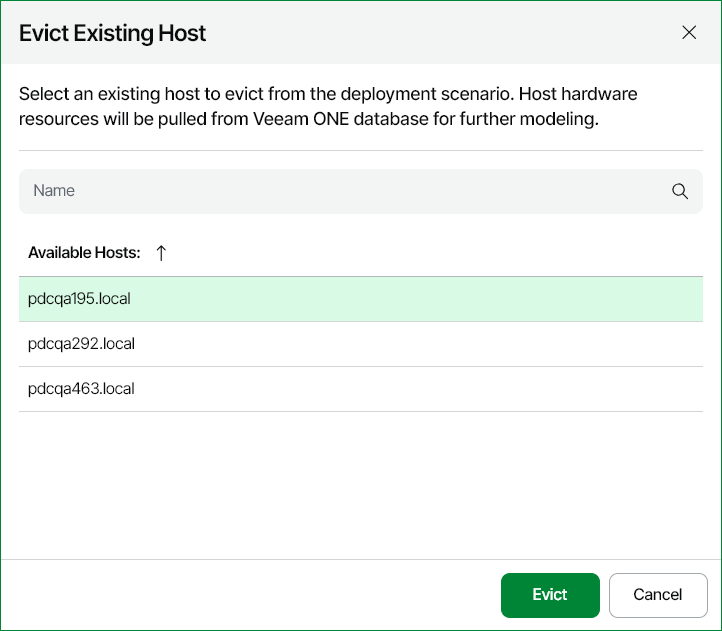

# Step 4. Define Project Scenarios

At the Scenario step of the wizard, change parameters of the deployment project scenario. A deployment project scenario describes configuration of the hosts or VMs that must be added or evicted from the target container. One scenario can combine conditions for adding and evicting both hosts and VMs.

To change parameters of the deployment project scenario:

* Click Add and choose which object you want to add to the selected container:

+ [New VM](#new_vm)
+ [New Host](#new_host)
+ [Existing VM](#copy_vm)
+ [Existing Host](#copy_host)

* Click Evict and choose which object you want to evict from the selected container:

+ [Existing VM](#evict_vm)
+ [Existing Host](#evict_host)

* Click Edit to modify the selected scenario entry.
* Click Delete to delete the selected scenario entry.

After you configure deployment scenario parameters, click Finish to save the deployment project.

Adding New VM

To simulate a situation of adding new VMs to a host or cluster:

1. At the Scenario step of the wizard, click Add and select New VM.
2. In the Add New VM window, specify VM properties:

* Name — VM name.
* Number of vCPUs — the number of virtual CPU cores allocated to the VM.
* vCPU frequency — each virtual CPU clock speed.
* Memory — the amount of memory resources allocated to the VM.
* Disk capacity — capacity of each virtual disk allocated to the VM.
* Number of disks — the number of virtual disks allocated to the VM.
* Number of VMs — the number of identical VMs to be added to the deployment project.

1. Click Add.

Adding New Host

To simulate a situation of adding new hosts to a cluster:

1. At the Scenario step of the wizard, click Add and select New Host.
2. In the Add New Host window, specify host properties:

* Name — the host name.
* Number of vCPUs — the number of virtual CPU cores allocated to the host.
* vCPU frequency — each virtual CPU clock speed.
* Memory — the amount of memory resources allocated to the host.
* Number of hosts — the number of identical hosts to be added to the deployment project.

1. Click Add.

Adding Existing VM

To simulate a situation of adding copies of an existing VM to a host or cluster:

1. At the Scenario step of the wizard, click Add and select Existing VM.
2. In the Add Existing VM window, select a VM from the list and specify the number of VMs to be added.

The VM selection scope includes all VMs in the selected container.

1. Click Add.

Adding Existing Host

To simulate a situation of adding copies of existing host to a cluster:

1. At the Scenario step of the wizard, click Add and select Existing Host.
2. In the Add Existing Host window, select a host from the list and specify the number of hosts to be added.

The host selection scope includes all hosts in the selected container.

1. Click Add.

Evicting Existing VM

To simulate a situation of evicting a VM from a host or cluster:

1. At the Scenario step of the wizard, click Evict and select Existing VM.
2. In the Evict Existing VM window, select a VM from the list.

The VM selection scope includes all VMs in the selected container.

1. Click Evict.

Evicting Existing Host

To simulate a situation of evicting a host from a cluster:

1. At the Scenario step of the wizard, click Evict and select Existing Host.
2. In the Evict Existing Host window, select a host from the list.

The host selection scope includes all hosts in the selected container.

1. Click Evict.

