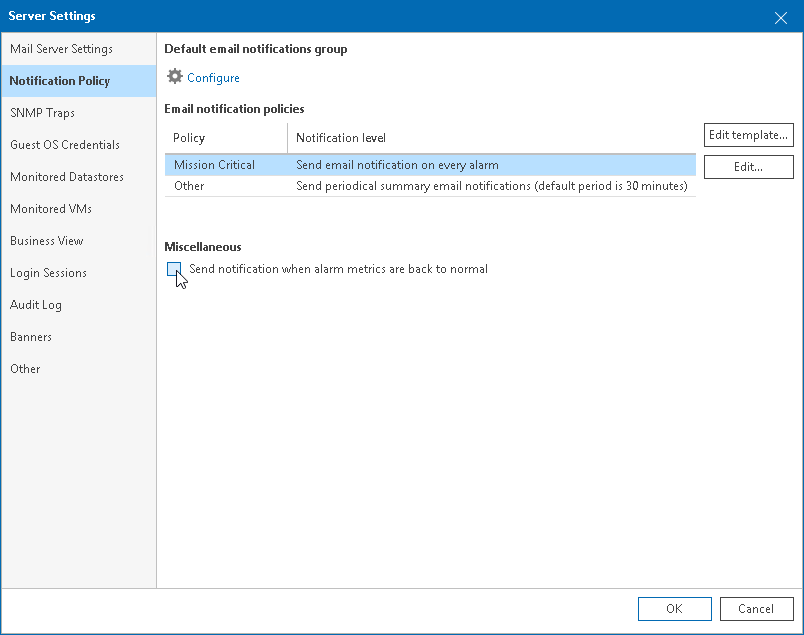

# Step 5. Disable Notifications About Resolved and Acknowledged Alarms

By default, Veeam ONE sends an email notification when an alarm is triggered, when its status changes to Error or Warning, when an alarm is resolved and acknowledged. If you do not want to receive notifications on resolved and acknowledged alarms, you can disable them.

To disable email notifications on resolved and acknowledged alarms:

1. Open Veeam ONE Client.

For details, see [Accessing Veeam ONE Components](access.md).

1. In the main menu, click Settings > Server Settings.

Alternatively, you can press [CTRL + S] on the keyboard.

1. In the Server Settings window, open the Notification Policy tab.
2. In the Miscellaneous section, clear the Send notification when alarm metrics are back to normal check box.
3. Click OK.

