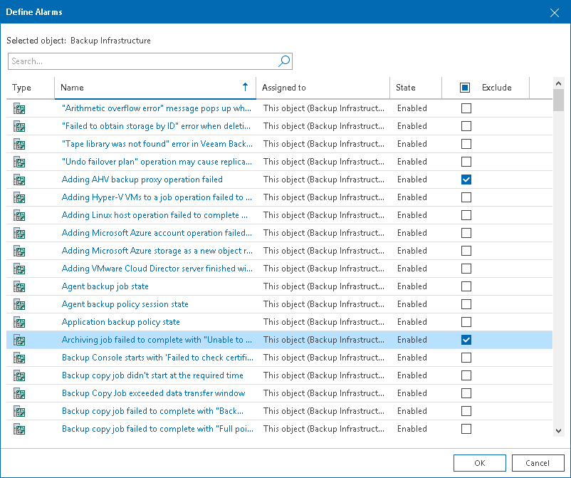

# Excluding Objects from Multiple Alarms

You can exclude a single infrastructure object from the scope of multiple alarms:

1. Open Veeam ONE Client.

For details, see [Accessing Veeam ONE Components](access.md).

1. At the bottom of the inventory pane, click the necessary view (Veeam Backup & Replication, Veeam Backup for Microsoft 365, Virtual Infrastructure, VMware Cloud Director, Business View).
2. In the inventory pane, select the necessary infrastructure object.
3. In the information pane, open the Alarms tab.
4. Select an alarm and do either of the following:

* Right-click the alarm and select Define alarms in the shortcut menu.
* In the Actions pane on the right, click Define Alarms.

1. In the Define Alarms window, select check boxes next to alarms from which you want to exclude the object.
2. Click OK.

Other Ways to Exclude Objects from Multiple Alarms

You can also exclude an object from multiple alarms using the object tree in the inventory pane.

1. Open Veeam ONE Client.

For details, see [Accessing Veeam ONE Components](access.md).

1. At the bottom of the inventory pane, click the necessary view (Veeam Backup & Replication, Veeam Backup for Microsoft 365, Virtual Infrastructure, VMware Cloud Director, Business View).
2. In the inventory pane, right-click the necessary object in the inventory pane and select Alarms > Define alarms from the shortcut menu.
3. In the Define Alarms window, select check boxes next to alarms from which you want to exclude the object.
4. Click OK.

