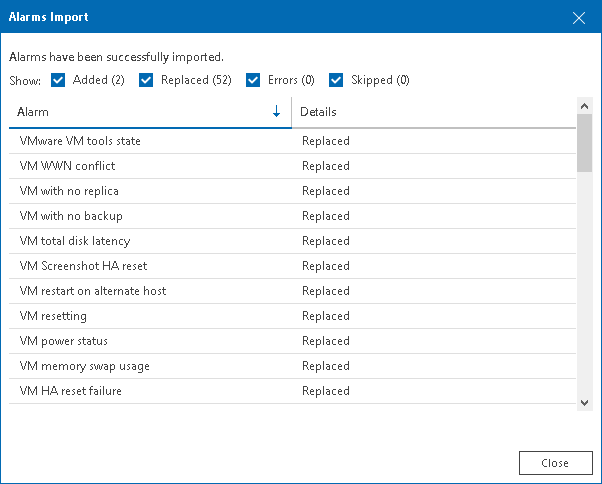

# Exporting and Importing Alarms

You can export alarms to an XML file and import alarms from an XML file. Exporting and importing alarms can be useful if you need to back up your alarm settings, or if you want to copy alarm settings from one Veeam ONE deployment to another.

You can use export and import options to copy alarm settings between different Veeam ONE versions. Veeam ONE 13 supports import of alarm settings that were exported from Veeam ONE version 8.0 and later.

Exporting Alarms

To export alarms to an XML file:

1. Open Veeam ONE Client.

For details, see [Accessing Veeam ONE Components](access.md).

1. At the bottom of the inventory pane, click Alarm Management.
2. In the alarm management tree, select the type of infrastructure object for which you want to export alarms.
3. Right-click the object and choose Export Alarms from the shortcut menu.
4. Save the XML file with alarm settings.

Importing Alarms

To import alarms from an XML file:

1. Open Veeam ONE Client.

For details, see [Accessing Veeam ONE Components](access.md).

1. At the bottom of the inventory pane, click Alarm Management.
2. In the alarm management tree, right-click any object and choose Import Alarms from the shortcut menu.
3. In the Alarms Import window:

* Specify a path to an XML file with alarm settings.
* Select the Import assignment check box if you want to import a list of alarms together with their assignment settings.
* Select the Replace all existing alarms check box if you want to replace existing alarms with imported alarms.

If you do not select this check box, but during import Veeam ONE detects alarms with matching names, Veeam ONE will suggest you to update settings of the existing alarm with data from the XML file. You can either replace the existing alarm with the alarm from the XML file, or leave the existing alarm without any changes.

If an alarm in the XML file does not match any existing alarm by name, Veeam ONE will create a new alarm.

1. When the import is finished, the Alarms Import window will display a report with the import status, the total number of added, replaced, and skipped alarms, and the number of alarms that were imported with errors.

Review the report and click Close to close the Alarms Import window.

