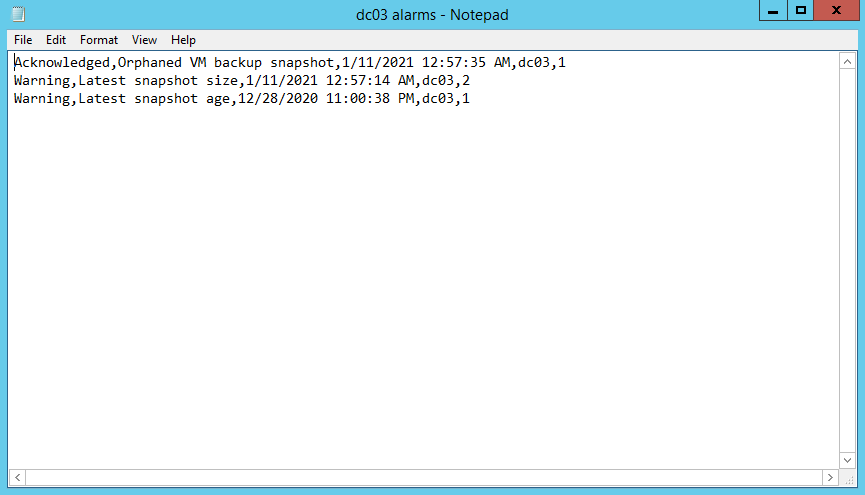

# Exporting Triggered Alarms

You can export information about triggered alarms to a CSV file. The file contains the following details for each exported alarm:

* Alarm status
* Alarm name
* Date and time when the alarm was triggered
* Name of the affected object
* Repeat count

To export one or more triggered alarms to a CSV file:

1. Open Veeam ONE Client.

For details, see [Accessing Veeam ONE Components](access.md).

1. At the bottom of the inventory pane, click the necessary view (Veeam Backup & Replication, Veeam Backup for Microsoft 365, Virtual Infrastructure, VMware Cloud Director, Business View).
2. In the inventory pane, select the necessary object.
3. In the information pane, open the Alarms tab.
4. Use the filters and the search field at the top of the list to display the alarms that you want to export.

For details on alarm filters, see [Searching for Alarms](view_alarms.md#search).

1. In the Actions pane on the right, click Export Alarms.
2. Save the CSV file with exported data.
3. Click OK.

The following image shows an example of alarm details exported to a CSV file.

