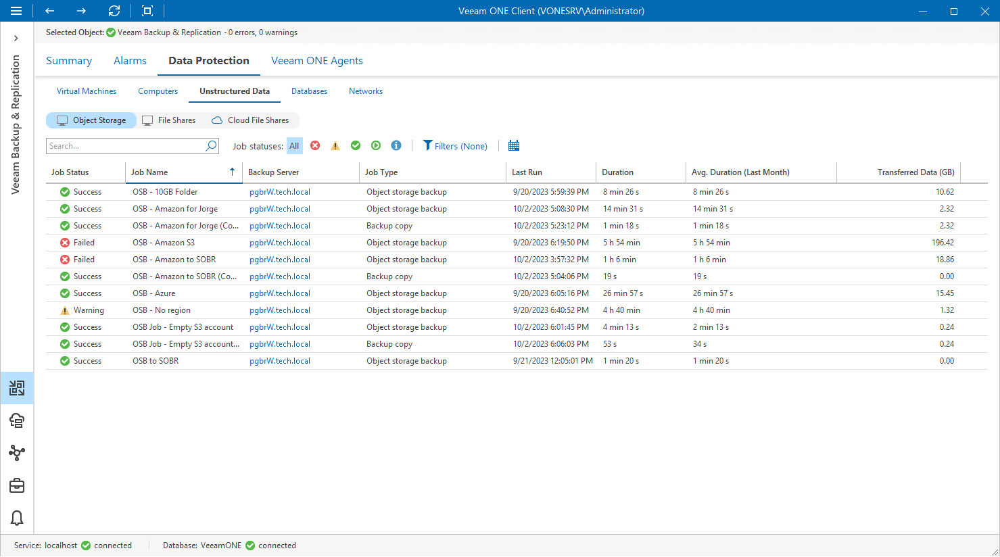
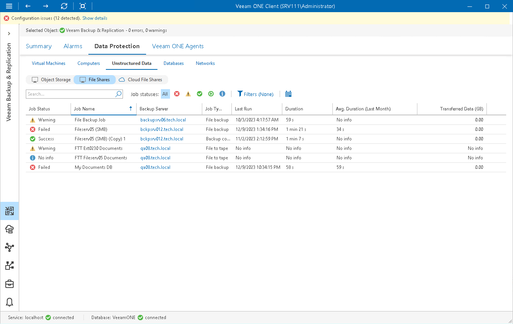
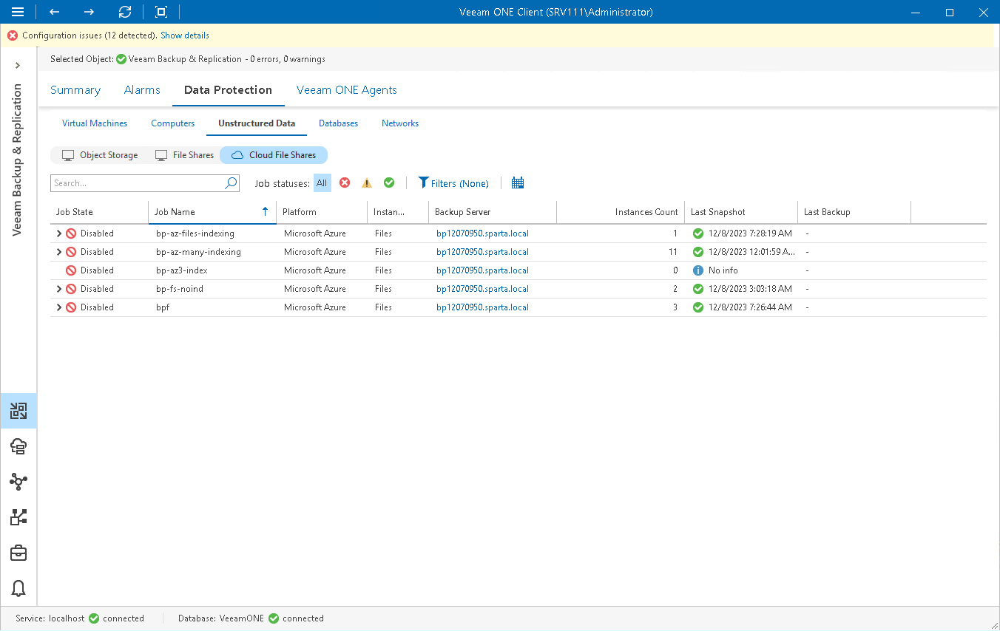

# Unstructured Data

Veeam ONE Client allows you to track object storage backup, object storage backup copy, object storage to tape, file backup, file backup copy, file to tape and file copy jobs configured to protect [object storage](#object) items and [on-premises](#onprem) and [cloud](#cloud) file shares.

You can track real-time job statistics at different levels of your backup infrastructure:

* Jobs managed by a specific backup server
* Jobs on all backup servers controlled by Veeam Backup Enterprise Manager
* All jobs across the entire backup infrastructure

Viewing Object Storage Job Details

To view the list of object storage jobs at the necessary backup infrastructure level:

1. Open Veeam ONE Client.

For details, see [Accessing Veeam ONE Components](access.md).

1. At the bottom of the inventory pane, click Veeam Backup & Replication.
2. In the inventory pane, select the necessary backup infrastructure node.
3. Open the Data Protection tab and navigate to Unstructured Data > Object Storage.
4. To find the necessary job, you can use filters at the top of the job list:

* To show or hide jobs that ended with a specific status, use the status buttons at the top of the list (Show all jobs, Show failed jobs, Show jobs with warnings, Show successful jobs, Show running jobs or Show jobs with no status).
* To show or hide jobs of a specific type, use the job type filter at the top of the list (Object storage backup, Backup copy, Object storage to tape).
* To set the time interval when jobs ran for the last time, use the Filter jobs by time period button. Release the button to discard the time period filter.
* To find jobs by name, use the search field at the top of the list.

The list of jobs shows all object storage backup, object storage backup copy and object storage to tape jobs for the backup infrastructure level that you selected in the inventory pane.

Each job in the list is described with a set of properties. To show or hide properties, right-click the list header and choose properties that must be displayed.

* Job Status — the latest status of the job session (Success, Warning, Failed, Running, or jobs with no status).
* Job Name — name of an object storage job.
* Backup Server — name of a backup server on which the job is configured. Click the server name link to drill down to the list of alarms for the chosen backup server.
* Job Type — job type (Object storage backup, Backup copy, Object storage to tape).
* Last Run — date and time of the latest job run.
* Duration — time taken to complete the job during its latest run.
* Avg. Duration (Last Month) — average time taken to complete the job (total job duration time for the previous month divided by the number of times the job ran).
* Transferred Data (GB) — amount of backup data that was transferred to the target destination (backup repository or tape) during the latest job run.

|  |
| --- |
| Note: |
| The “No info” label indicates that no information is available for the job because data has not been collected yet. |

Viewing File Share Job Details

To view the list of file jobs at the necessary backup infrastructure level:

1. Open Veeam ONE Client.

For details, see [Accessing Veeam ONE Components](access.md).

1. At the bottom of the inventory pane, click Veeam Backup & Replication.
2. In the inventory pane, select the necessary backup infrastructure node.
3. Open the Data Protection tab and navigate to Unstructured Data > File Shares.
4. To find the necessary job, you can use filters at the top of the job list:

* To show or hide jobs that ended with a specific status, use the status buttons at the top of the list (Show all jobs, Show failed jobs, Show jobs with warnings, Show successful jobs, Show running jobs or Show jobs with no status).
* To show or hide jobs of a specific type, use the job type filter at the top of the list (File backup, Backup copy, Backup to tape, File to tape or File copy).
* To set the time interval when jobs ran for the last time, use the Filter jobs by time period button. Release the button to discard the time period filter.
* To find jobs by name, use the search field at the top of the list.

The list of jobs shows all file backup, file backup copy, file to tape and file copy jobs for the backup infrastructure level that you selected in the inventory pane.

Each job in the list is described with a set of properties. To show or hide properties, right-click the list header and choose properties that must be displayed.

* Job Status — the latest status of the job session (Success, Warning, Failed, Running, or jobs with no status).
* Job Name — name of a file share job.
* Backup Server — name of a backup server on which the job is configured. Click the server name link to drill down to the list of alarms for the chosen backup server.
* Job Type — job type (File backup, Backup copy, Backup to tape, File to tape or File copy).
* Last Run — date and time of the latest job run.
* Duration — time taken to complete the job during its latest run.
* Avg. Duration (Last Month) — average time taken to complete the job (total job duration time for the previous month divided by the number of times the job ran).
* Transferred Data (GB) — amount of backup data that was transferred to the target destination (backup repository or tape) during the latest job run.

|  |
| --- |
| Note: |
| The “No info” label indicates that no information is available for the job because data has not been collected yet. |

Viewing Cloud File Share Job Details

To view the list of file jobs at the necessary backup infrastructure level:

1. Open Veeam ONE Client.

For details, see [Accessing Veeam ONE Components](access.md).

1. At the bottom of the inventory pane, click Veeam Backup & Replication.
2. In the inventory pane, select the necessary backup infrastructure node.
3. Open the Data Protection tab and navigate to Unstructured Data > Cloud File Shares.
4. To find the necessary job, you can use filters at the top of the job list:

* To show or hide jobs that ended with a specific status, use the status buttons at the top of the list (Show all jobs, Show jobs with errors, Show jobs with warnings, Show successful jobs).
* To show or hide jobs for a specific platform, use the job type filter at the top of the list (AWS or Microsoft Azure).
* To set the time interval when jobs ran for the last time, use the Filter jobs by time period button. Release the button to discard the time period filter.

* To find jobs by name, use the search field at the top of the list.

The list of jobs shows all file backup policies for the backup infrastructure level that you selected in the inventory pane.

Each job in the list is described with a set of properties. To show or hide properties, right-click the list header and choose properties that must be displayed.

* Job State — the latest status of the job session (Success, Warning, Failed, Running, or jobs with no status).
* Job Name — name of the file share job.
* Platform — name of the cloud platform for which file job is configured.
* Instance Type — type of the protected instance.
* Backup Server — name of the backup server on which the job is configured. Click the server name link to drill down to the list of alarms for a chosen backup server.
* Instances Count — number of Microsoft Azure Files or AWS EFS instances processed during the last cloud protection session.
* Last Snapshot — date and time when the latest cloud-native snapshot was created for a Microsoft Azure Files or AWS EFS instance.
* Last Backup — date and time of the latest backup restore point was created for a Microsoft Azure Files or AWS EFS instance.
* Last Backup Copy — date and time of the latest backup copy restore point was created for a Microsoft Azure Files or AWS EFS instance.
* Instance ID — id of the Microsoft Azure Files or AWS EFS instance.

|  |
| --- |
| Note: |
| The “No info” label indicates that no information is available for the job because data has not been collected yet. |

