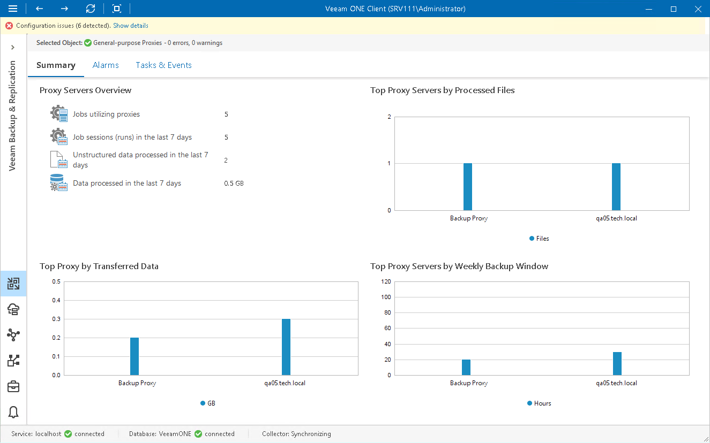

# General-Purpose Proxy Servers Overview

The summary dashboard for the General-purpose Proxies node provides a configuration overview and performance analysis for general-purpose proxies managed by a backup server.

Proxy Servers Overview

The section provides the following details:

* Number of file backup jobs configured to use proxies
* Number of job sessions that the proxies have processed during the last 7 days
* Number of unstructured data items that the proxies have processed during the last 7 days
* Total amount of data that the proxy has processed during the last 7 days

Top Proxy Servers by Processed Items

The chart shows 5 file proxies that processed the greatest number of unstructured data items over the last 7 days.

To draw the chart, Veeam ONE analyzes how many items were successfully processed by every proxy.

The chart helps you detect the most heavily loaded general-purpose proxies and optimize the performance of your backup infrastructure. If specific proxies are overloaded with unstructured data processing tasks, and the tasks often need to wait for proxy resources, you may need to deploy additional proxies or balance the processing load by assigning jobs to other proxies.

Top Proxy by Transferred Data

The chart shows 5 proxies that transferred the greatest amount of backup data to the target destination (backup repository) over the last 7 days.

For every proxy, the chart shows the total amount of data that the proxy transferred over the network after the source-side deduplication and compression. The chart can help you detect backup proxies that transfer the greatest amount of backup data and estimate the load that file backup jobs impose on the network.

Top Proxy Servers by Weekly Backup Window

The chart allows you to detect the most 'busy' proxy servers over the last 7 days.

For every proxy, the chart shows the cumulative amount of time that the proxy was retrieving, processing and transferring unstructured data.

The chart can help you reveal possible resource bottlenecks. If the backup window on the chart is abnormally large, this can evidence of low source data retrieval speed, high proxy CPU load or insufficient network throughput.

