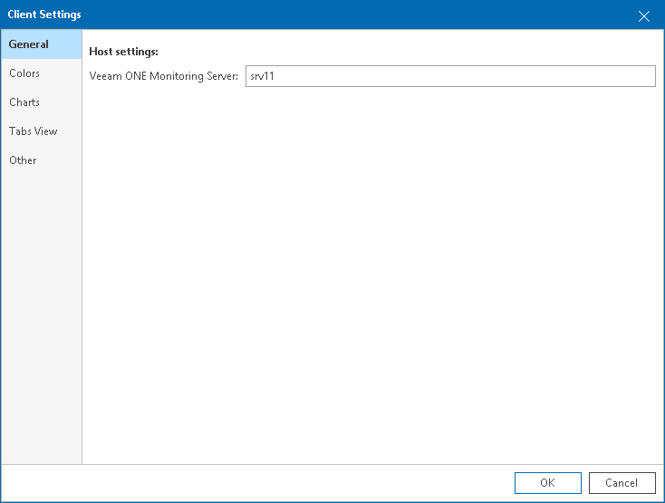

# General Settings

In client general settings, you can specify an FQDN name or IP address of a machine where the Veeam ONE Server component is installed.

To specify client general settings:

1. Open Veeam ONE Client.

For details, see [Accessing Veeam ONE Components](access.md).

1. In the main menu, click Settings > Client Settings.

Alternatively, press [CTRL + O] on the keyboard.

1. In the Client Settings window, open the General tab.
2. In the Host settings section, specify an FQDN or IP address of a machine where the Veeam ONE Server component is installed.

* If the connection to the Veeam ONE Server component is successful, the Veeam ONE Monitoring Server field is filled automatically with the name of the machine where Veeam ONE Server component is installed or localhost.
* If Veeam ONE Server component is not found on the specified machine, Veeam ONE will prompt you to specify the correct name in the client settings.

