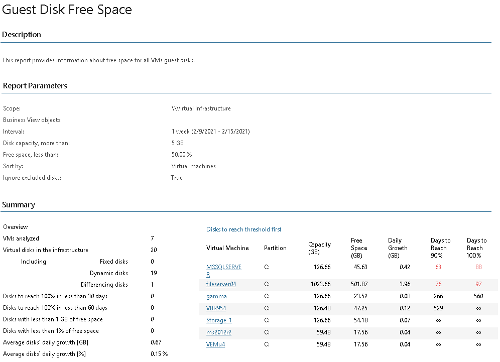
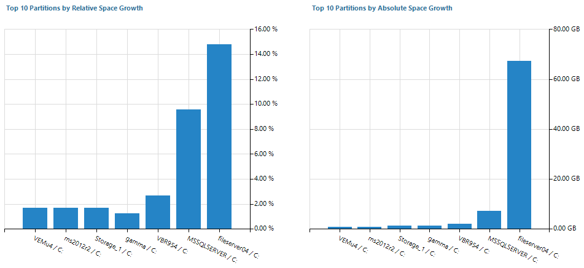
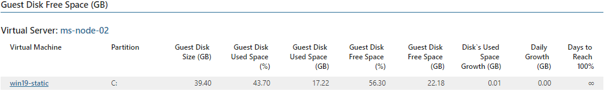

# Guest Disk Free Space (Hyper-V)

The report provides information on the amount of free disk space for VM guest OS.

|  |
| --- |
| Note: |
| * To view the report, you must specify guest OS credentials for the guest OS of Microsoft Hyper-V VMs. For details, see [Specify VM Guest OS Credentials](hyperv_guest_credentials.md). * The report includes information only for VMs running Windows guest OSes. |

The report analyzes VM guest disks and displays their capacity, the amount of guest disk free space, shows disk space usage trends, and predicts how many days are left for a disk to reach the specified threshold.

* The Summary section provides an overview of analyzed VM guest disks, shows how many VMs will run out of disk resources sooner than other VMs, and shows average disk growth trends.
* The Disks to reach threshold first table displays a list of VMs that will run out of guest disk space sooner than other VMs. For each VM, the table shows guest disk capacity and the amount of free space left, daily disk growth trend and the number of days left before the occupied disk space will reach 90% and 100% of its capacity.

If a value in the Days to reach 90% or Days to reach 100% column is highlighted with red, a disk will reach the specified threshold in less than 180 days.

* The Top 10 Partitions by Relative Space Growth chart shows 10 guest disks that used the greatest amount of space over the reporting period in relative terms (amount of occupied disk space against the disk capacity).
* The Top 10 Partitions by Absolute Space Growth chart shows 10 guest disks that used more space over the reporting period in absolute terms (amount of occupied disk space in GB).
* The Guest Disk Free Space (GB) section displays a list of all VMs included into the report and their guest disks. The table details disk capacity, the amount of free and used space, trends for disk space usage growth, daily disk growth, and shows how many days are left until a disk reaches its limit.

Click a VM name in the Virtual Machine column to drill down to VM guest disk space usage details.

Report Parameters

You can specify the following report parameters:

* Infrastructure objects: defines a virtual infrastructure level and its sub-components to analyze in the report.
* Business View objects: defines Business View groups to analyze in the report. The parameter options are limited to objects of the Virtual Machine type.

Business View groups from the same category are joined using Boolean OR operator, Business View groups from different categories are joined using Boolean AND operator. That is, if you select groups from the same category, the report will contain all objects that are included in groups. However, if you select groups from different categories, the report will contain only objects that are included in all selected groups.

* Period: defines the time period to analyze in the report.
* Disk capacity, more than: defines the minimum capacity threshold for a disk to analyze in the report. If disk capacity is less than the specified value, the report will not analyze this disk.
* Free space, less than: defines the maximum amount of free space for a disk to analyze in the report. If the amount of free space on a disk is more than the specified value, the report will not analyze this disk.
* Sort by: defines how data will be sorted in the report (Virtual Machines, Relative Growth, Absolute Growth).
* Ignore excluded disks: defines whether guest disks excluded in Veeam One Monitor to analyze in the report.

You can exclude certain VM guest disks from monitoring in Veeam ONE Client. To learn more, see [Microsoft Hyper-V Infrastructure Summary](hyperv_summary.md).

Use Case

The report allows you to examine VM guest disk utilization and track disk usage growth. This helps you plan resource allocation and ensure your VMs have enough disk resources for stable operation.

Page updated 2026-08-03

