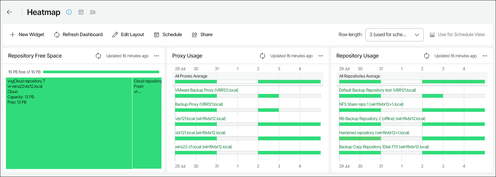

# Heatmap

The Heatmap dashboard visually represents key resource utilization in your backup infrastructure. The dashboard allows real-time monitoring of free space on repositories as well as repository and proxy usage.

You can access the Heatmap dashboard from the Dashboard tab in Veeam ONE Web Client.

Widgets Included

Repository Free Space

This widget shows the amount of total and free disk space on each of your backup repositories in a form of a treemap.

Each section of the treemap contains information about a single repository. To see detailed information, hover the pointer over a section. Color of a section is determined by the amount of free space relative to the total space: green color means repository disk space is mostly free while red color means repository disk space is mostly used.

Click a section associated with a scale-out repository to see detailed information about its extents.

Proxy Usage

This widget shows concurrent tasks that backup proxy servers processed during the week.

Each row of the diagram contains information about a single proxy server.

To see details on hourly proxy server usage, click a row. In the section dedicated to a specific proxy server, each cell represents server activity during 1-hour time periods.

To open the section with detailed information about proxy server settings and activity during specific hour, click the cell. This section includes the following elements:

* Backup server — host name of the backup server.
* CPU count — number of CPU cores.
* Concurrent tasks limit — number of maximum concurrent tasks.
* Max concurrent tasks processed — configured number of concurrent tasks processed.
* CPU usage — CPU resources consumed, in percent.
* Memory usage — memory resources consumed, in percent.
* Related jobs — list of the concurrent jobs.

Color of a cell is determined by number of processed concurrent tasks relative to maximum number of concurrent tasks: green color means none or few concurrent tasks were processed while red color means number of concurrent tasks is close to or reaches maximum.

Repository Usage

This widget shows concurrent tasks that backup repositories processed during the week.

Each row of the diagram contains information about a single repository.

To see details on hourly repository usage, click a row. In the section dedicated to a specific repository, each cell represents server activity during 1-hour time periods.

To open the section with detailed information about repository settings and activity during specific hour, click the cell. This section includes the following elements:

* Repository type — type of the repository.
* Backup server — host name of the backup server.
* Concurrent tasks limit — configured number of maximum concurrent tasks.
* Max concurrent tasks processed — number of concurrent tasks processed.
* Disk Bytes/sec — operation speed of the repository disk.
* Related jobs — list of the concurrent jobs.

Color of the section is determined by the number of processed concurrent tasks relative to the maximum number of concurrent tasks: green color means none or few concurrent tasks were processed while red color means the number of concurrent tasks is close to or reaches maximum.

