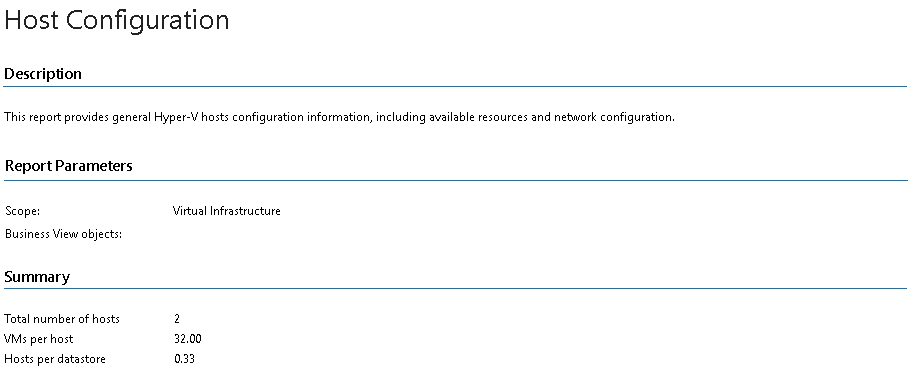

# Host Configuration (Hyper-V)

This report documents the current configuration of hosts in your infrastructure.

* The Summary section provides an overview of the infrastructure, including the total number of hosts, number of VMs per host and number of hosts per datastore.
* The General Information section provides information on each host, including host name, manufacturer, system model, OS type, update version and host status.
* The Available Resources section provides information on resources available for each host, including CPU frequency, number of cores, amount of physical and virtual memory, local and shared storage size and the number of VMs.
* The Network Configuration section provides information on network configuration for each host, including network name, type, number of VMs, adapter and IP address.

Report Parameters

You can specify the following report parameters:

* Infrastructure objects: defines a virtual infrastructure level and its sub-components to analyze in the report.
* Business View objects: defines Business View groups to analyze in the report. The parameter options are limited to objects of the Host type.

Business View groups from the same category are joined using Boolean OR operator, Business View groups from different categories are joined using Boolean AND operator. That is, if you select groups from the same category, the report will contain all objects that are included in groups. However, if you select groups from different categories, the report will contain only objects that are included in all selected groups.

Use Case

The report allows you to identify configuration issues, optimize resource provisioning and better handle current and future workloads.

