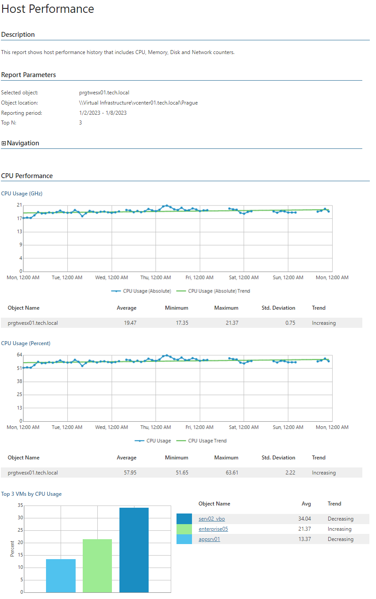

# Host Performance (Hyper-V)

This report aggregates historical data and shows performance statistics for a selected host across a time range.

The report shows tables and performance charts with statistics on CPU, memory, disk and network usage for the host. The report also lists top resource consuming VMs and calculates resource usage trends for them.

* The Navigation section shows path to the selected object, including VMware vSphere VC, datacenter, cluster and host system.

Click a cluster name to drill down to performance charts with statistics on CPU, memory, disk and network usage for the cluster.

* The Performance subsections provide information on CPU, memory, disk and network usage, including usage trends and top resource consuming VMs for the host.

Click a VM name in the list of top resource consuming VMs to drill down to performance charts with statistics on CPU, memory, disk and network usage for the VM.

Report Parameters

You can specify the following report parameters:

* Object: defines the host to analyze in the report.
* Period: defines the time period to analyze in the report. Note that the reporting period must include at least one successfully completed Object properties data collection task for the selected host. Otherwise, the report will contain no data.
* Business hours only: defines time of a day for which historical performance data will be used to calculate the performance trend. All data beyond this interval will be excluded from the baseline used for data analysis.
* Top N: defines the maximum number of hosts and VMs to display in the report output.

Use Case

The report provides an overview of hardware resource consumption for the selected host. This information may help you identify hosts with performance issues, balance workloads, right-size resource provisioning and assure high availability/failover protection for VMs across the growing virtual environment.

