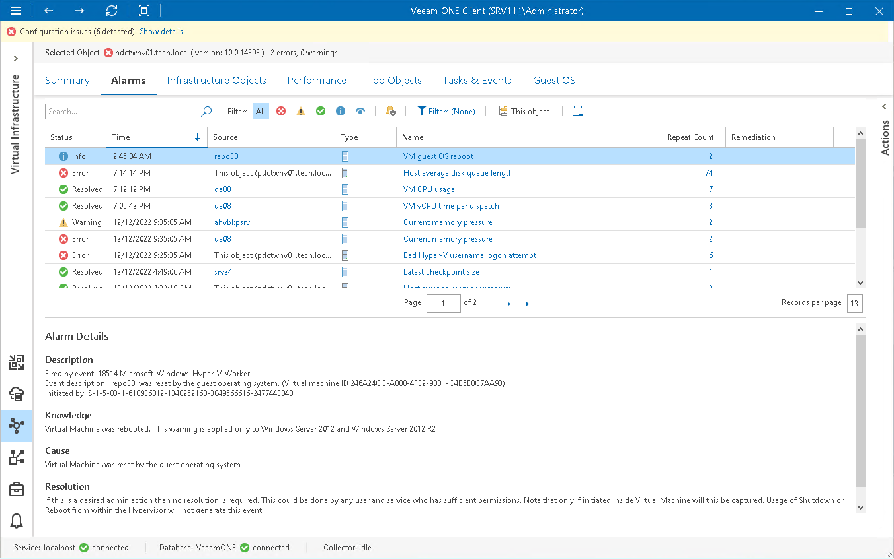

# Microsoft Hyper-V Alarms

Veeam ONE includes a set of alarms for monitoring Microsoft Hyper-V virtual environment. These alarms warn you about events or changes that can affect performance of operations and services in the virtual environment.

To view the list of triggered Microsoft Hyper-V alarms:

1. Open Veeam ONE Client.

For details, see [Accessing Veeam ONE Components](access.md).

1. At the bottom of the inventory pane, click Virtual Infrastructure.
2. In the inventory pane, select the necessary virtual infrastructure node.
3. Open the Alarms tab.

On the Alarms dashboard, you can view triggered alarms, track alarm history, resolve and acknowledge alarms and perform other actions. For details on available actions, see [Working with Triggered Alarms](triggered_alarms.md).

