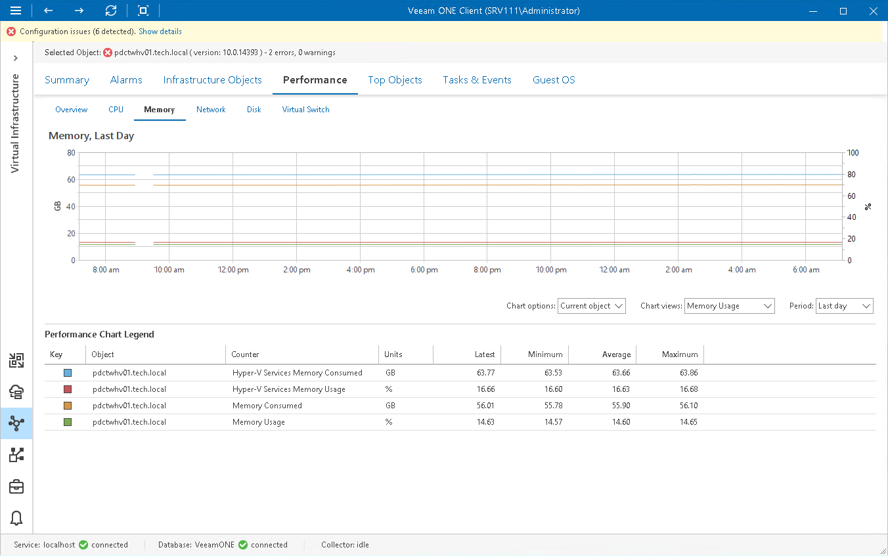

# Microsoft Hyper-V Performance Charts

Performance charts show how key performance counters have been changing over time to help you diagnose performance issues and perform root cause analysis.

Performance charts include the following elements:

* Axes

Performance charts display data for a particular time period (the horizontal axis) using two scales of measurement units (vertical axes). The measurement units may vary depending on selected performance counters. However, the number of units is always limited to two.

* Graphs

Performance charts include one or more graphs. Every graph on a performance chart visualizes a specific counter for an infrastructure object or a container of infrastructure objects.

* Legend

The chart legend shows details about objects and counters displayed in the chart. The details include key color, object name, list of counters and units of measurement, the latest, minimum, average, and maximum counter values.

* Chart views

Performance charts come with a number of predefined chart views. Every view logically groups related counters to display the most valuable data and help you speed up troubleshooting and root cause analysis of performance problems.

Performance charts can be easily customized. For details on customization options, see [Customizing Microsoft Hyper-V Performance Charts](customize_hyperv_charts.md).

Accessing Performance Charts

To access a performance chart for an infrastructure object or infrastructure segment:

1. Open Veeam ONE Client.

For details, see [Accessing Veeam ONE Components](access.md).

1. At the bottom of the inventory pane, click Virtual Infrastructure.
2. In the inventory pane, select the necessary infrastructure object or segment.
3. Open the Performance tab.

In This Section

* [Overview](hyperv_overall.md)
* [CPU Performance Chart](hyperv_cpu.md)
* [Memory Performance Chart](hyperv_memory.md)
* [Network Performance Chart](hyperv_network.md)
* [Virtual Switch Performance Chart](hyperv_virtual_switch.md)
* [Cluster/Host Disk Performance Chart](hyperv_host_disk.md)
* [VM Disk Performance Chart](hyperv_vm_disk.md)
* [Disk Space Chart](hyperv_disk_space.md)
* [Local Volume Performance Chart](hyperv_local_volume.md)
* [Cluster Shared Volume Disk Performance Chart](hyperv_csv_2012.md)
* [SMB Share Disk Performance Chart](hyperv_smb.md)
* [HA SMB Performance Chart](hyperv_ha_smb.md)
* [Volume Cache Performance Chart](hyperv_volume_cache.md)
* [Customizing Microsoft Hyper-V Performance Charts](customize_hyperv_charts.md)

