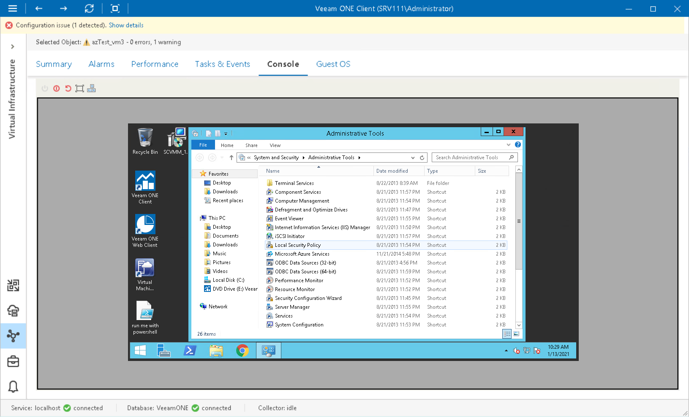

# Microsoft Hyper-V VM Console

From within the VM console, you can easily isolate the root cause of VM performance problems and execute management tasks — for example, restart an unresponsive VM.

This option requires no additional software installed on the Veeam ONE server and is available for both Window-based and Linux-based OS’s.

Prerequisites

To access the console of a Linux-based VM, you must download PuTTY.exe and provide path to it in [Veeam ONE Client client settings](other_settings.md).

Accessing VM Console

You can access the VM console right from the Veeam ONE Client interface:

1. Open Veeam ONE Client.

For details, see [Accessing Veeam ONE Components](access.md).

1. At the bottom of the inventory pane, click Virtual Infrastructure.
2. In the inventory pane, select the necessary VM.
3. Open the Console tab.

You can use buttons at the top of the Console tab to change the VM power state:

* Power on — powers on a VM if it is powered off. Resumes a VM if it is paused.
* Power off — shuts down the guest OS and powers off a VM.
* Hard reset — resets a VM without waiting for the guest OS and VM processes to stop. It is recommended to use this option only if you want to reboot a stuck or unresponsive VM.
* Full screen — switches between the full screen mode and a separate window running the VM console.
* Send Ctrl+Alt+Del — sends the [Ctrl+Alt+Del] command to a VM.

To access the VM console or change the VM power state, you can also right-click the VM in the inventory pane and use one of the following shortcut menu commands:

* To access the VM using Windows Remote Desktop Connection, choose Remote Management > Connect to VM.
* To change the VM power state, choose Remote Management and click the necessary command.
* To send the [Ctrl+Alt+Del] command to the VM, choose Send Ctrl+Alt+Del. Note that this command is only available if the VM Console tab is active.

