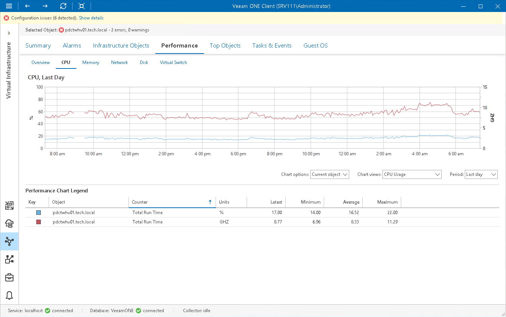

# CPU Performance Chart

The CPU chart displays historical statistics on CPU utilization for the selected virtual infrastructure object.

Host

The following table provides information on predefined views and counters that apply to hosts.

Host

| Chart View | Counter | Measurement Unit | Description |
| CPU Usage | Total Run Time | Percent | Percentage of time a physical processor required to run both VMs and the hypervisor itself. |
| Total Run Time | GHz | Amount of time physical processor required to run both VMs and the hypervisor itself. |
| CPU Usage by Host/VMs | Guest Run Time | Percent | Percentage of time a physical processor required to run VMs. |
| Hypervisor Run Time | Percent | Percentage of time a physical processor required to run a hypervisor. |
| vCPU Total Run Time | Percent | Percentage of time vCPUs were used by all VMs on a host. |
| CPU Idle Time | Idle Time | Percent | Percentage of time a physical processor spent in an idle state. |
| CPU Interrupts | Total Interrupts/sec | Number | Number of interrupts to which a processor was asked to respond. Interrupts are generated from hardware components like hard disk controller adapters and network interface cards. A sustained value over 1000 usually indicates of a problem. |
| CPU Bottlenecks | Host CPU Wait Time | Microsecond | Average amount of time that VMs on a host spend waiting for their virtual processors to be dispatched onto a logical processor. |

Virtual Machine

The following table provides information on predefined views and counters that apply to VMs.

Virtual Machine

| Chart View | Counter | Measurement Unit | Description |
| CPU Usage | Guest Run Time | Percent | Percentage of time a physical processor required to run a VM. |
| Guest vCPU Run Time | MHz | Amount of virtual CPU resources used by a VM. |
| CPU Usage by Host | Hypervisor Run Time | Percent | Percentage of physical processor time consumed by Hyper-V host for a VM. |
| Total Run Time | Percent | Percentage of time a Hyper-V host required to run a VM, plus time consumed by the VM itself. |
| vCPU Total Run Time | MHz | Amount of vCPU resources consumed by all VMs on a host. |
| CPU Bottlenecks | CPU Wait Time | Microsecond | Amount of time that a virtual processor spends waiting to be dispatched onto a logical processor. |

For objects that are parent to hosts and VMs, Veeam ONE Client displays rollup values.
Charts for folders and clusters display rollup values for all hosts in the container. Chart for a resource displays rollup values for all VMs registered as shared resources.

Page updated 2026-07-29

