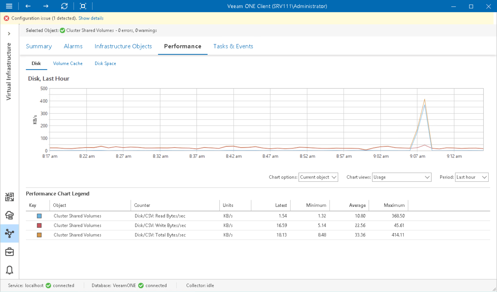

# Cluster Shared Volume Disk Performance Chart

The Disk chart displays historical statistics on disk usage for the selected Cluster Shared Volume.

")

The following table provides information on predefined views and counters.

Cluster Shared Volume Disk Performance Chart

| Chart View | Counter | Measurement Unit | Description |
| Usage | Disk/CSV: Read Bytes/sec | KB/s | Rate at which data is read from the volume in the Direct Access or Redirected Access mode. |
| Disk/CSV: Write Bytes/sec | KB/s | Rate at which data is written to the volume in the Direct Access or Redirected Access mode. |
| Disk/CSV: Total Bytes/sec | KB/s | Rate at which data is read from and written to the volume in the Direct Access or Redirected Access mode. |
| IOPS | Disk/CSV: Reads/sec | Number | Rate at which read operations were performed directly on a volume. |
| Disk/CSV: Writes/sec | Number | Rate at which write operations were performed directly on a volume. |
| Disk/CSV2012: IOPS | Number | Rate at which read and write operations were performed directly on a volume. |
| Latency | Disk/CSV: Read Latency | Millisecond | Average latency between the time a read request arrived to a file system and the time when it was completed. |
| Disk/CSV: Write Latency | Millisecond | Average latency between the time a write request arrived to a file system and the time when it was completed. |
| Disk/CSV: Latency | Millisecond | Average latency required to complete read and write operations on a volume. |
| Datastore Queue Length | Disk/CSV: Read Queue Length | Number | Number of read operations queued for a volume. |
| Disk/CSV: Write Queue Length | Number | Number of write operations queued for a volume. |
| Disk/CSV: Queue Length | Number | Number of read and write operations that were queued for a volume during the sample interval. |
| Direct/Redirected Usage | Disk/CSV: Redirected Bytes/sec | KB/s | Average amount of data transferred to or from a disk during write or read operations over the network stack. |
| Disk/CSV: Direct Bytes/sec | KB/s | Average amount of data transferred to or from a disk during write or read operations. |
| Direct/Redirected Latency | Disk/CSV: Direct Latency | Millisecond | Average latency required to for complete read and write operations on a volume in the Direct Access mode. |
| Disk/CSV: Redirected Latency | Millisecond | Average latency required to complete read and write requests on a volume in the Redirected Access mode. |
| Direct/Redirected IOPS | Disk/CSV: Direct IOPS | Number | Rate at which read and write operations were performed directly on a disk. |
| Disk/CSV: Redirected IOPS | Number | Rate at which read and write operations were redirected to a volume through the network. |

Page updated 2026-07-17

