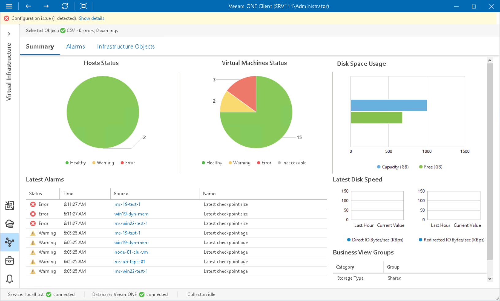

# Cluster Shared Volume Summary

The CSV summary dashboard provides the health status and performance overview for the selected Cluster Shared Volume. In addition, it shows the state of objects that can affect the volume performance — hosts that work with the CSV and VMs residing on the CSV.

Hosts Status, Virtual Machines Status

The charts reflect the health status of hosts that work with the volume and the state of VMs stored on the volume.

Every colored segment represents the number of objects with a certain status — objects with errors (red), objects with warnings (yellow) and healthy objects (green). Click a chart segment or a legend label to drill down to the list of alarms with the corresponding status for hosts or VMs.

Disk Space Usage

The chart reflects the amount of available and used disk space on the Cluster Shared Volumes.

Latest Alarms

The list displays the latest 15 alarms for the Cluster Shared Volumes and objects that work with the volumes. Click a link in the Source column to drill down to the list of alarms for the selected object.

For more information, see [Working with Triggered Alarms](triggered_alarms.md).

Latest Disk Speed

The section displays the current direct and redirected I/O values as well as the average values for the past hour.

Page updated 2026-08-07

