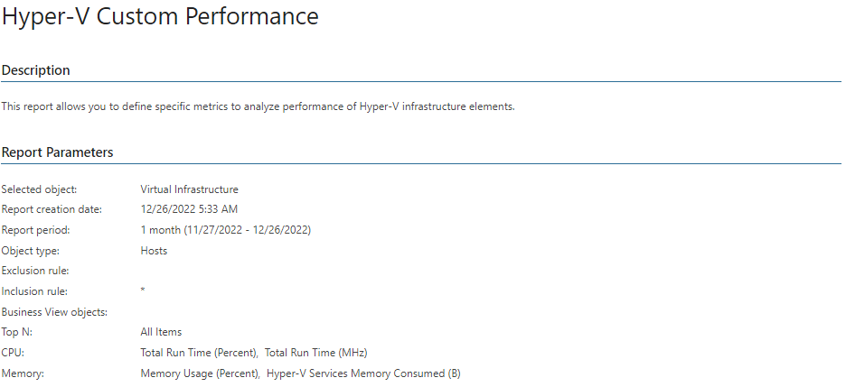
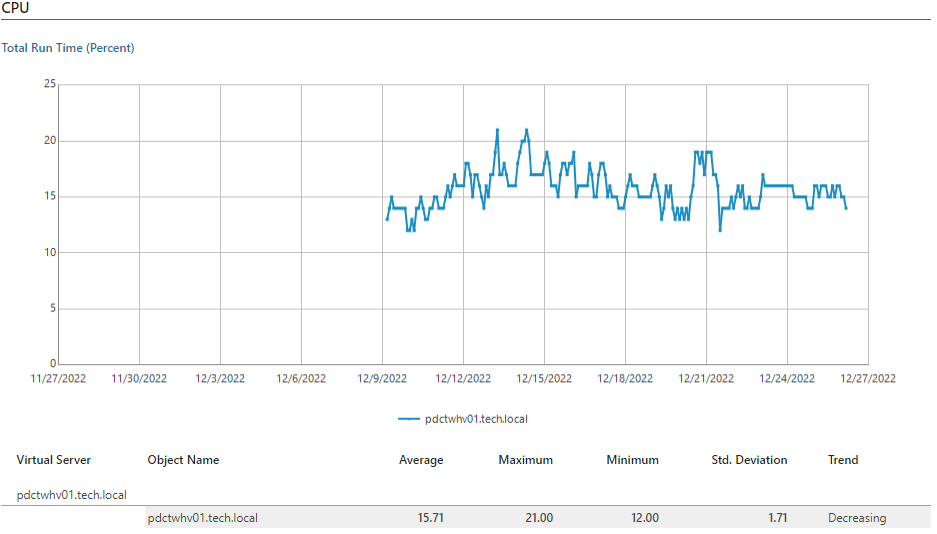

# Hyper-V Custom Performance

This report allows you to define specific CPU, memory, network and disk metrics to analyze performance of Hyper-V hosts, VMs, Cluster Shared Volumes and SMB shares.

Report Parameters

You can specify the following report parameters:

* Infrastructure objects: defines a virtual infrastructure level and its sub-components to analyze in the report.
* Business View objects: defines Business View groups to analyze in the report.

Business View groups from the same category are joined using Boolean OR operator, Business View groups from different categories are joined using Boolean AND operator. That is, if you select groups from the same category, the report will contain all objects that are included in groups. However, if you select groups from different categories, the report will contain only objects that are included in all selected groups.

* Period: defines the time period to analyze in the report. Note that the reporting period must include at least one successfully completed Object properties data collection task for the selected scope. Otherwise, the report will contain no data.

* Business hours only: defines time of a day for which historical performance data will be used to calculate the performance trend. All data beyond this interval will be excluded from the baseline used for data analysis.

* Object type: defines the infrastructure object to analyze in the report (Hosts, Virtual Machines, Local Datastore, CSV 2008, CSV, SMB Shares).
* Measured entities: defines subsystems to analyze in the report (CPU, Memory, Network, Disk or Virtual Switch). The list of available subsystems will depend on the selected object type.
* Metrics: defines metrics to analyze in the report. The list of available metrics will depend on the selected monitor subsystem.
* Inclusion rule/Exclusion rule: defines a list of objects that should be included in/excluded from the report scope:

+ Use the Inclusion rule option to define names of virtual infrastructure objects that should be included in the report. All objects not specified in the Inclusion rule field will be excluded from the baseline used for data analysis.
+ Use the Exclusion rule option to define names of virtual infrastructure objects that should be excluded from the report. All objects not specified in the Exclusion rule field will be included in the baseline used for data analysis.

|  |
| --- |
| Note: |
| The Inclusion rule/Exclusion rule parameters support wildcards. Search is not case sensitive.  To illustrate how to use wildcard queries, consider the following example. You have selected 4 hosts as a report scope: 2 NAS servers (NASserv1, NASserv2) and 2 Active Directory servers (AD01 and AD02).  If you want the report to show performance details only for the NAS servers, type nasserv\* in the Inclusion rule field. Alternatively, type ad\* in the Exclusion rule field. |

* Top N: defines the maximum number of VMs to display in the report.
* Show graphs: defines whether to show charts in the report output.

Use Case

Use this report to investigate specific performance issues in the environment.

Page updated 2026-08-05

