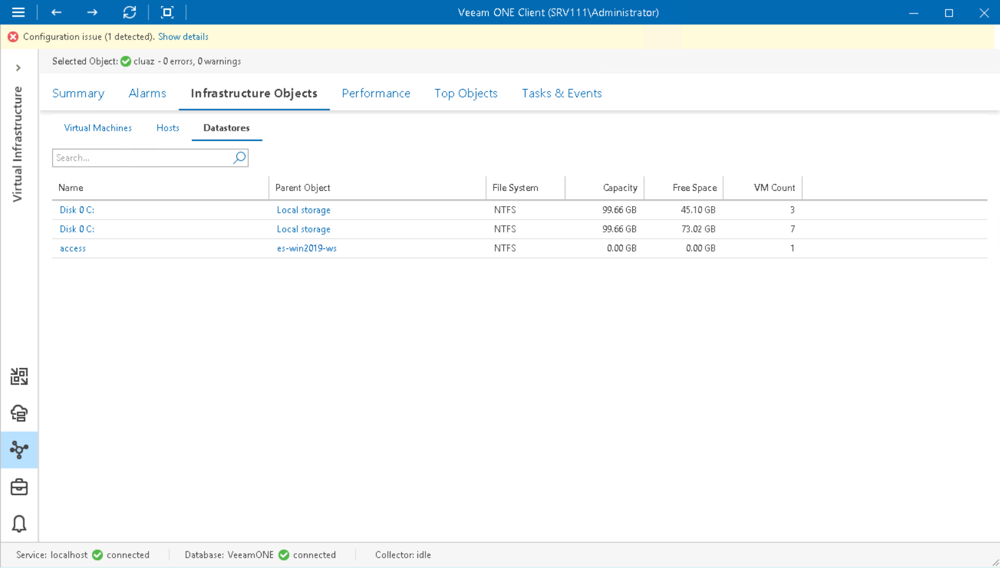

# Microsoft Hyper-V Datastores

You can view the list of datastores in your Microsoft Hyper-V infrastructure — on System Center Virtual Machine Manager or in a cluster.

To view the list of datastores:

1. Open Veeam ONE Client.

For details, see [Accessing Veeam ONE Components](access.md).

1. At the bottom of the inventory pane, click Virtual Infrastructure.
2. In the inventory pane, select the necessary infrastructure container.
3. Open the Infrastructure Objects tab and navigate to Datastores.
4. To find the necessary datastore by name, use the Search field at the top of the list.
5. Click column names to sort datastores by a specific parameter.

For example, to view what datastores have the greatest amount of free space, you can sort datastores in the list by Free Space.

For every datastore in the list, the following details are available:

* Name — name of a datastore
* Parent Object — name of the parent object in the infrastructure
* File System — type of the file system on the datastore
* Capacity — total capacity of a datastore
* Free Space — amount of available free space on a datastore
* VM Count — number of VMs that reside on a datastore

You can choose what columns to show or hide in the Datastores table:

* To hide one or more columns, right-click the table header, and clear check boxes next to the corresponding data fields.
* To make hidden columns visible, right-click the table header, and select check boxes next to the corresponding data fields.

