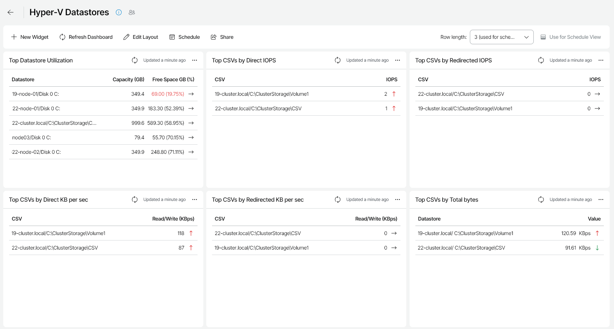

# Hyper-V Datastores

The Hyper-V Datastores dashboard provides at-a-glance view on resource usage and performance of disks and Cluster Shared Volumes in the Microsoft Hyper-V environment. The dashboard helps you assess disk capacities and prevent potential performance bottlenecks.

You can access the Hyper-V Datastores dashboard from the Dashboard tab in Veeam ONE Web Client.

Widgets Included

Top Datastore Utilization

This widget displays a list of disks that will run out of free space sooner than other disks.

A datastore is highlighted with red if the amount of free space is less than 5% of the capacity value.

Values in parentheses show free space values for the previous week.

Top CSVs by Direct IOPS

This widget displays a list of Cluster Shared Volumes with the highest number of I/O operations performed in the direct access mode.

Arrows on the right show how the number of IOPS has changed over the previous week\*.

Top CSVs by Redirected IOPS

This widget displays a list of Cluster Shared Volumes with the highest number of I/O operations performed in the redirected access mode.

Arrows on the right show how the number of IOPS has changed over the previous week\*.

Top CSVs by Direct KB per Sec

This widget displays a list of Cluster Shared Volumes with the highest rate at which bytes were transferred to/from the CSV during write/read operations in the direct access mode.

Arrows on the right show how the Direct Bytes/sec metric value has changed over the previous week\*.

Top CSVs by Redirected KB per Sec

This widget displays a list of Cluster Shared Volumes with the highest rate at which bytes were transferred to/from the CSV during write/read operations in the redirected access mode.

Arrows on the right show how the Redirected Bytes/sec metric value has changed over the previous week\*.

Top CSVs by Total bytes

This widget displays a list of Cluster Shared Volumes with the highest rate at which data was read from and written to the volume in the direct and redirected access modes.

Arrows on the right show how the Total Bytes/sec metric value has changed over the previous week\*.

Top CSVs by IOPS

This widget displays a list of Cluster Shared Volumes with the highest rate at which reads and writes were performed directly on the volume.

Arrows on the right show how the IOPS metric value has changed over the previous week\*.

Top CSVs by Latency

This widget displays a list of Cluster Shared Volumes with the highest average latency for completing read and write requests on the volume.

Arrows on the right show how the Latency metric value has changed over the previous week\*.

\*The arrow allows you to compare the results of the current week to the results of the previous week, and to track how the trend has evolved. For example, a grey arrow pointing right next to the IOPS value means that the average number of IOPS has not changed over the past week, a green arrow pointing down means that the average number of IOPS has decreased, while a red arrow pointing up means that the average number of IOPS has increased.

