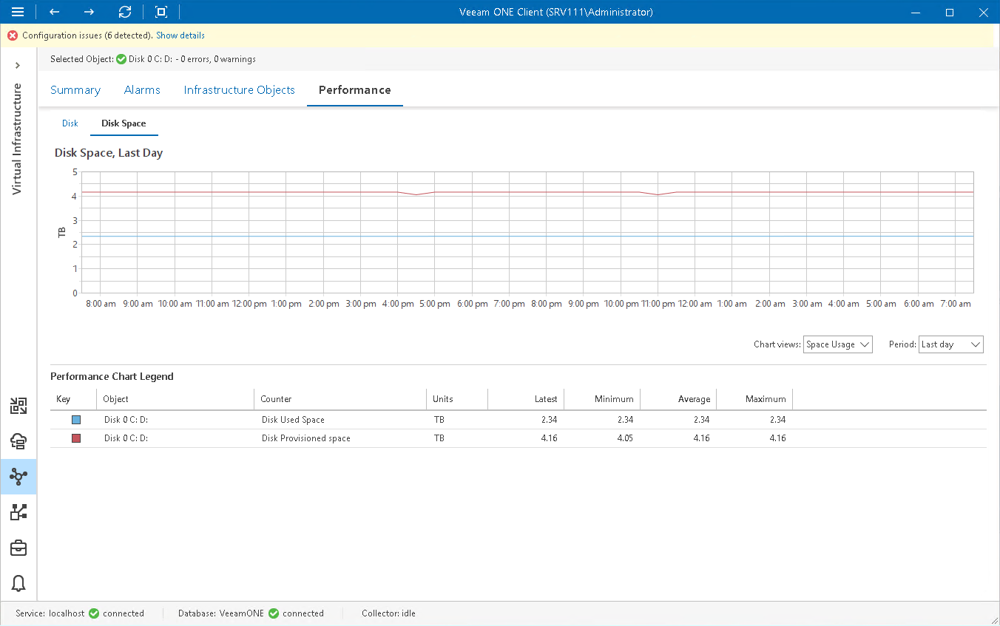

# Disk Space Chart

The Disk Space chart it displays historical statistics on disk space resources and usage for the selected disk.

The following table provides information on predefined views and counters.

Disk Space Chart

| Chart View | Counter | Measurement Unit | Description |
| Space Usage | Disk Free Space | TB | Amount of free space on a disk. |
| Disk Provisioned Space | TB | Amount of disk space provisioned to VMs. |
| Disk Used Space | TB | Amount of used space on a disk. |

