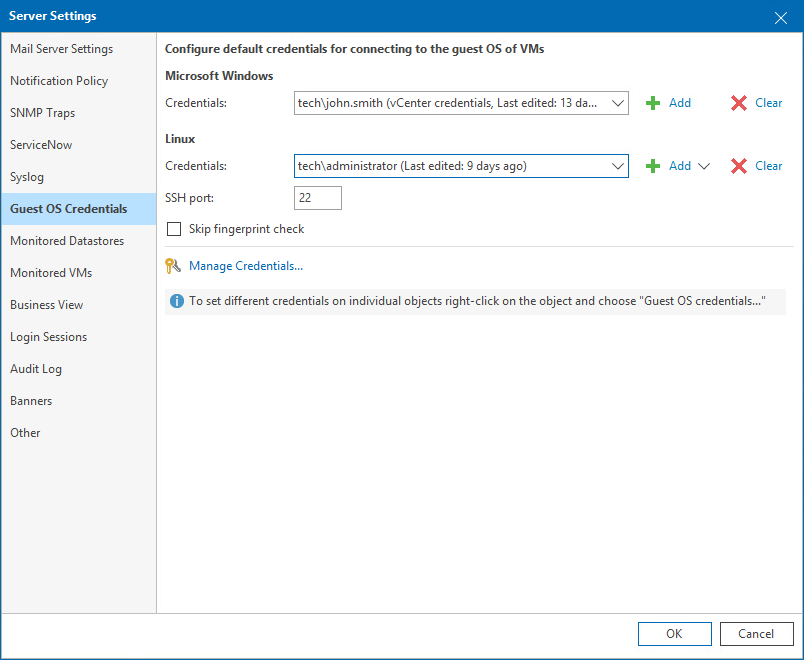

# Step 6. Specify VM Guest OS Credentials

After you connect one or more Microsoft Hyper-V servers, you must specify credentials of an account that will be used to collect data from Windows-based guest OSes on VMs. If you do not specify guest OS credentials, Veeam ONE will use connection credentials to display guest OS data (in particular, data about guest disks) in monitoring dashboards, alarms and reports.

You can specify the account credentials for VM guest OS at the following levels of the Microsoft Hyper-V infrastructure:

* Microsoft Hyper-V infrastructure
* VM containers, such as hosts and clusters

* Individual VMs

If you specify guest OS account credentials at multiple levels, Veeam ONE will use the following order of priority: VM > VM container > Microsoft Hyper-V infrastructure. For example, if account credentials are specified both at the VM and VM container level, Veeam ONE will collect guest OS data using an account set at the VM level.

Specifying Account Credentials for Microsoft Hyper-V Infrastructure

You can specify account credentials at the level of the Microsoft Hyper-V infrastructure. Veeam ONE will use this account to connect to all VMs running on Microsoft Hyper-V hosts unless you specify other credentials for specific VMs or VM containers.

To specify account credentials for all VMs in the Microsoft Hyper-V infrastructure:

1. Open Veeam ONE Client.
2. In the main menu, click Settings and select Server Settings.

Alternatively, press the [CTRL+S] on the keyboard.

1. In the Server Settings window, open the Guest OS Credentials tab.
2. Specify guest OS credentials:

* In the Microsoft Windows section, select credentials of an account that will be used to collect data from the guest OS of Windows-based VMs. To create a new credentials record, click Add.

For details on requirements to the account, see [Connection to VM Guest OS](guest_os_connection.md).

* In the Linux section, select credentials of an account that will be used to collect data from the guest OS of Linux-based VMs. To create a new credentials record, click Add and select Standard account or Linux private key.

In the SSH port field, change the default connection port if required.

To disable fingerprint validation for Linux VMs, select Skip fingerprint check.

To access credentials manager, click the Manage Credentials link. For more information on working with credentials, see [Security](credentials_manager.md).

1. Click OK.

Specifying Account Credentials for Containers and VMs

You can specify account credentials at the level of specific VMs or VM containers. This can be helpful if an account specified at the level of the Microsoft Hyper-V infrastructure does not have enough permissions on specific VMs or VM containers.

To specify account credentials for individual VMs or VM containers:

1. Open Veeam ONE Client.
2. At the bottom of the inventory pane, click Virtual Infrastructure.
3. Right-click the necessary VM or VM container and select Guest OS Credentials from the shortcut menu.
4. In the Guest OS Credentials window, select the Use these credentials option and specify credentials of an account that will be used to collect guest OS data from Microsoft Hyper-V VMs.
5. Click OK.

