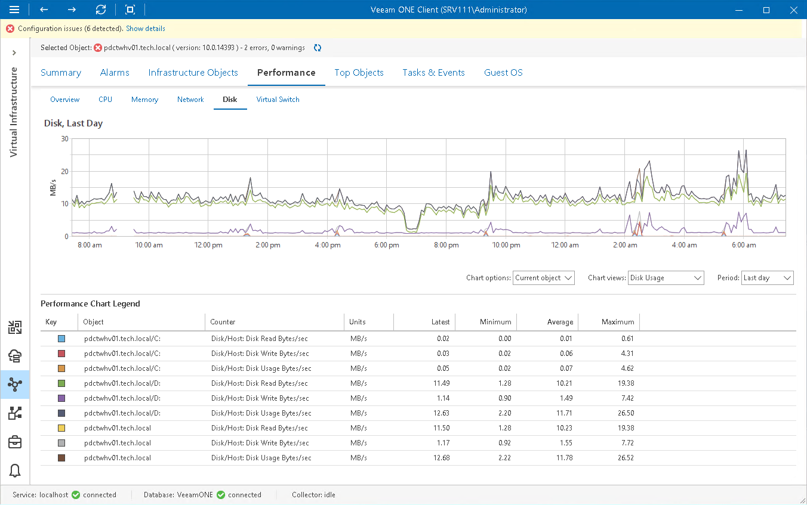

# Cluster/Host Disk Performance Chart

The Disk chart is available for Microsoft Hyper-V clusters and hosts. The chart displays historical statistics on disk usage for the selected cluster or host.

The following table provides information on predefined views and counters.

Cluster/Host Disk Performance Chart

| Chart View | Counter | Measurement Unit | Description |
| Disk Usage | Disk/Host: Disk Read | MB/s | Rate at which bytes are transferred from a disk during read operations. |
| Disk/Host: Disk Write | MB/s | Rate at which bytes are transferred from a disk during write operations. |
| Disk/Host: Disk Usage | MB/s | Rate at which bytes are transferred to and from a disk during read and write operations. |
| Disk Queue Length | Disk/Host: Avg Disk Queue Length | Number | Average number of read and write requests that were queued for a disk during the sample interval. |
| Disk Latency | Disk/Host: Avg Disk sec/Read | Millisecond | Average amount of time that a read operation from a disk takes. |
| Disk/Host: Avg Disk sec/Write | Millisecond | Average amount of time that a write operation to a disk takes. |

