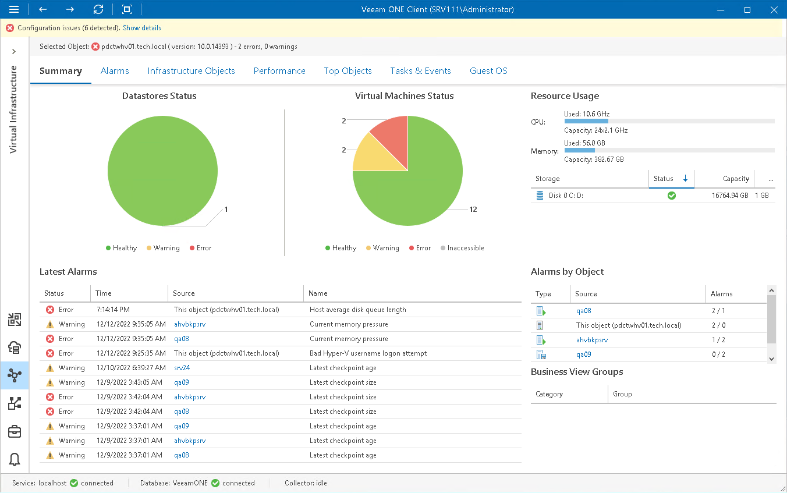

# Host Summary

The host summary dashboard provides the health status and performance overview for the selected Microsoft Hyper-V host and its child objects.

Datastores Status, Virtual Machines Status

The charts reflect the status of volumes connected to the host and the status of VMs running on the host.

Every chart segment represents the number of objects with a certain status — objects with errors (red), objects with warnings (yellow) and healthy objects (green). Click a chart segment or a legend label to drill down to the list of alarms with the corresponding status for host child objects.

Resource Usage

The section displays capacity and usage summary for host CPU and memory. It also shows an overview for volumes connected to the host — state of the volume, its capacity and the amount of free space on the volume.

Latest Alarms

The list displays the latest 15 alarms triggered for the host and its child objects. Click a link in the Source column to drill down to the list of alarms for the host and its child objects.

Alarms by Object

The list displays 15 objects with the greatest number of alarms (including the host and its child objects).

The value in the Alarms column shows the number of errors and warnings for an object. For example, 3/1 means that there are 3 error alarms and 1 warning alarm triggered for the object. Click a link in the Source column to drill down to the list of alarms related to the host and its child objects.

For more information, see [Working with Triggered Alarms](triggered_alarms.md).

Business View Groups

The section displays the list of categories and groups to which the host is included.

Page updated 2026-08-03

