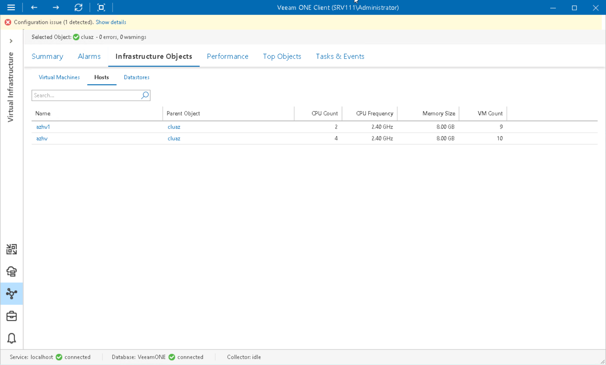

# Microsoft Hyper-V Hosts

You can view the list of Microsoft Hyper-V hosts in your virtual infrastructure — on System Center Virtual Machine Manager or in a cluster.

To view the list of hosts:

1. Open Veeam ONE Client.

For details, see [Accessing Veeam ONE Components](access.md).

1. At the bottom of the inventory pane, click Virtual Infrastructure.
2. In the inventory pane, select the necessary infrastructure container.
3. Open the Infrastructure Objects tab and navigate to Hosts.
4. To find the necessary host by name, use the Search field at the top of the list.
5. Click column names to sort hosts by a specific parameter.

For example, to view hosts with the greatest number of VMs, you can sort VMs in the list by VM Count.

For every host in the list, the following details are available:

* Name — name of the host
* Parent Object — name of the parent object in the infrastructure
* CPU Count — number of CPU cores on a host
* CPU Frequency — frequency of a host CPU core in GHz
* Memory Size — amount of physical memory available on a host
* VM Count — number of VMs that reside on a host

You can choose what columns to show or hide in the Hosts table:

* To hide one or more columns, right-click the table header, and clear check boxes next to the corresponding data fields.
* To make hidden columns visible, right-click the table header, and select check boxes next to the corresponding data fields.

