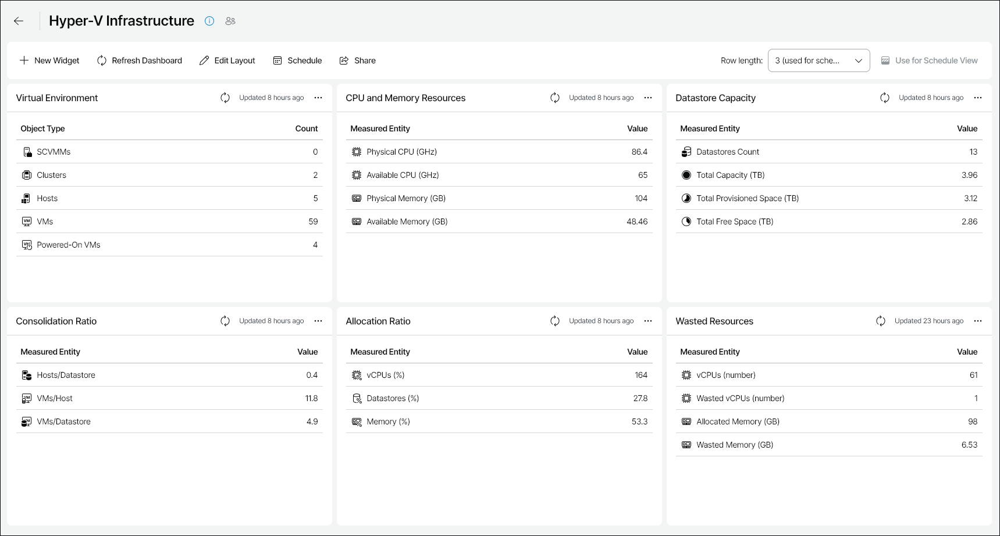

# Hyper-V Infrastructure

The Hyper-V Infrastructure dashboard provides at-a-glance view of configuration of the Microsoft Hyper-V infrastructure and helps you assess the overall performance and resource usage efficiency.

You can access the Hyper-V Infrastructure dashboard from the Dashboard tab in Veeam ONE Web Client.

Widgets Included

Virtual Environment

This widget shows the total number of SCVMM servers, clusters, Hyper-V hosts and VMs in your environment, as well as the number of currently running VMs.

CPU and Memory Resources

This widget assesses physical compute resources deployed across Hyper-V hosts and shows the amount of available resources.

Datastores Capacity

This widget provides information on the number of volumes in the virtual environment, their total capacity, the amount of provisioned and free space left.

Consolidation Ratio

The widget tracks the amount of virtual hardware placed on physical hardware:

* Hosts/Datastore ratio shows the average number of hosts connected to a single volume.
* VMs/Host ratio shows the average number of VMs running on a single physical host.
* VMs/Datastore ratio shows the average number of VMs that store data on a single volume.

Allocation Ratio

The widget tracks the amount of resources allocated to VMs (allocated resources against physical resources, in percent):

* vCPU allocation ration shows the amount of CPU resources allocated to VMs.
* Datastores allocation ratio shows the amount of volume space allocated to VMs.
* Memory allocation ratio shows the amount of RAM allocated to VMs.

Wasted Resources

The widget tracks the amount of available and wasted resources:

* vCPU value shows the number of vCPUs configured for VMs.
* vCPU Wasted value shows the number of vCPUs that can be reclaimed from oversized VMs.
* Allocated Memory shows the amount of memory allocated to VMs.
* Memory Wasted value shows the amount of memory that can be reclaimed from oversized VMs.

