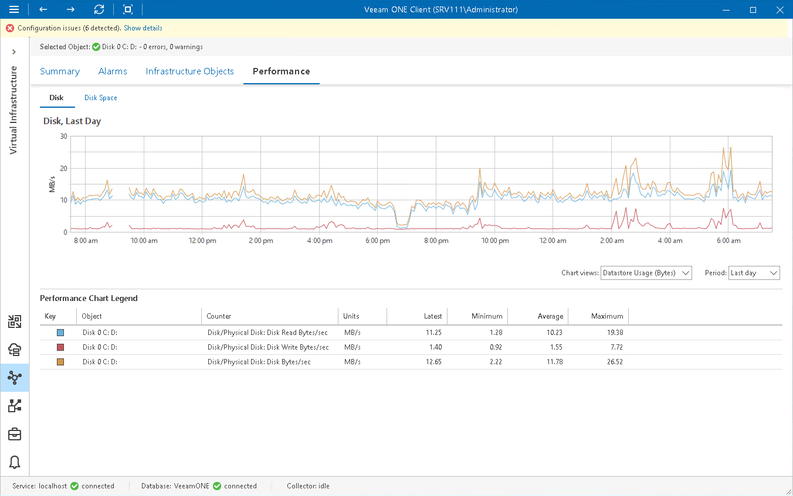

# Local Volume Performance Chart

The Disk chart displays historical statistics on disk usage for the selected local volume.

The following table provides information on predefined views and counters.

Local Volume Performance Chart

| Chart View | Counter | Measurement Unit | Description |
| Datastore Usage | Disk/Physical Disk: Disk Read | MB/s | Rate at which data is read from a volume. |
| Disk/Physical Disk: Disk Write | MB/s | Rate at which data is written to a volume. |
| Disk/Physical Disk: Disk | MB/s | Sum of read and write rates for a volume. |
| Datastore Queue Length | Disk/Physical Disk: Avg. Disk Queue Length | Number | Average number of read and write operations queued for a volume. |
| Datastore IOPS | Disk/Physical Disk: Disk Transfers/sec | Number | Number of read and write operations completed per second, regardless of how much data they involve.  This counter measures disk utilization. If the value exceeds 50, it can be an indicator of a bottleneck. |
| Datastore Latency | Disk/Physical Disk: Avg Disk sec/Read | Millisecond | Average time that a read operation from a volume takes. |
| Disk/Physical Disk: Avg Disk sec/Write | Millisecond | Average time that a write operation to a volume takes. |

