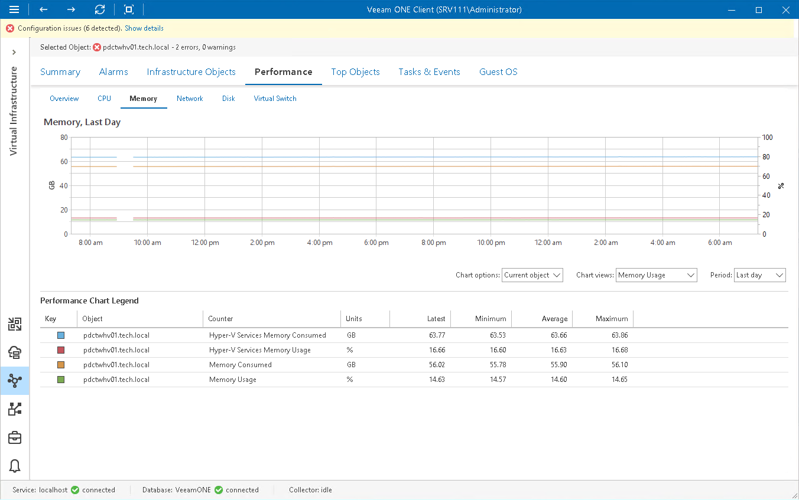

# Memory Performance Chart

The Memory chart displays historical statistics on memory utilization for the selected virtual infrastructure object.

Host

The following table provides information on predefined views and counters that apply to hosts.

Host

| Chart View | Counter | Measurement Unit | Description |
| Memory Usage | Hyper-V Services Memory Consumed | GB | Amount of memory currently consumed by Hyper-V services. |
| Hyper-V Services Memory Usage | Percent | Amount of memory resources currently used by Hyper-V services. |
| Memory Consumed | GB | Amount of physical memory resources used on a host. |
| Memory Usage | Percent | Memory usage as percentage of available machine memory. |
| Memory Pressure | Average Pressure | Percent | Amount of memory resources available on a host. |
| Committed Memory | Committed | GB | Demand for virtual memory. The counter shows how much memory were allocated for processes and to which processes the OS has committed a RAM page frame or a page slot in the pagefile (or both). As the Committed counter grows above the available RAM, paging increases and the amount of the pagefile in use increases as well. At some point, paging activity starts to affect perceived performance significantly. |
| Memory Swap Faults | Page Faults/sec | Number | Page faults that occur when any process attempts to read from a virtual memory location that is marked as 'not present'. The best counter value is zero.  The counter displays both hard page and soft page faults. |
| Memory Swap Rate | Page Reads/sec | Number | Lack of memory resources. The counter shows how often the system reads from disk because of hard page faults.  The counter shows the number of read operations, not taking into account the number of pages retrieved in each operation. The counter can reveal different kinds of faults that cause system delays. |
| Page Writes/sec | Number | Number of attempts taken by running the write command/operation to clear unused items out of memory.  Pages are written to disk only if they change while in physical memory, so they are likely to hold data, not code. The counter shows write operations, not taking into account the number of pages written in each operation. |
| Pages Input/sec | Number | Rate at which memory pages are read from disk. |
| Pages Output/sec | Number | Rate at which memory pages are written to disk. |
| Pages/sec | Number | Sum of Pages Input/sec and Pages Output/sec counters.  The counter indicates how often the system uses a hard drive to store and retrieve memory-associated data. |

Virtual Machine

The following table provides information on predefined views and counters that apply to VMs.

Virtual Machine

| Chart View | Counter | Measurement Unit | Description |
| Memory Usage | Guest Visible Physical Memory | GB | Amount of memory visible to the guest OS running inside a VM. |
| Physical Memory | GB | Amount of memory currently used by a VM. |
| Memory Pressure | Demand | B | Amount of memory a VM requires to run all active processes.  The counter represents the total committed memory based on data obtained from other performance counters. |
| Current Pressure | Percent | Current pressure in a VM.  To calculate the counter, Microsoft Hyper-V analyzes the VM total committed memory and calculates the pressure as the following ratio: the amount of memory the VM wants / the amount of memory the VM has. |

For objects that are parent to hosts and VMs, Veeam ONE Client displays rollup values.
Charts for folders and clusters display rollup values for all hosts in the container. Chart for a resource displays rollup values for all VMs registered as shared resources.

Page updated 2026-07-29

