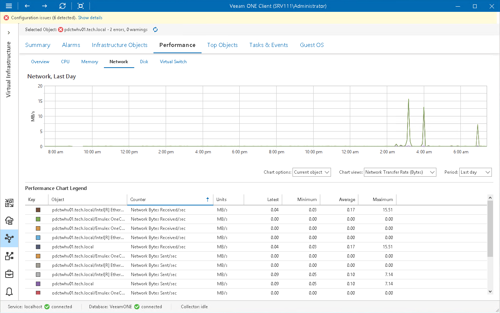

# Network Performance Chart

The Network chart displays historical statistics on network usage for the selected virtual infrastructure object.

Host

The following table provides information on predefined views and counters that apply to hosts.

Host

| Chart View | Counter | Measurement Unit | Description |
| Network Transfer Rate | Network Bytes Received/sec | KB/s | Rate at which data is received across each network adapter on a host. The counter represents the bandwidth of the network. |
| Network Bytes Sent/sec | KB/s | Rate at which data is sent across each network adapter on a host. |
| Network Bytes Total/sec | KB/s | Rate at which data is sent and received across a network interface. |
| Network Output Queue Length | Network Output Queue Length | Number | Length of the output queue, in packets.  If the Output Queue Length value exceeds 2, it can be an indicator of delays across the network. In this case, you should find and eliminate the bottleneck to improve performance. |
| Network Connections | Network Offloaded Connections | Number | Number of TCP connections (over both IPv4 and IPv6) currently handled by a TCP Chimney Offload network adapter. |
| Network Errors | Network Outbound Errors | Number | Number of outbound packets that could not be transmitted because of errors. |
| Network Received Errors | Number | Number of inbound packets that contained errors preventing them from being deliverable to a higher-layer protocol. |
| Network Transfer Rate (Packets) | Network Packets Received/sec | Number | Rate at which packets are received on the network interface. |
| Network Packets Sent/sec | Number | Rate at which packets are sent on the network interface. |
| Network Packets/sec | Number | Rate at which packets are sent and received on the network interface. |

Virtual Machine

The following table provides information on predefined views and counters that apply to VMs.

Virtual Machine

| Chart View | Counter | Measurement Unit | Description |
| Virtual Network Usage | Virtual Network Bytes Received/sec | KB/s | Rate at which data is received across the vNIC instance on a VM. The counter represents the bandwidth of the network. |
| Virtual Network Bytes Sent/sec | KB/s | Rate at which data is sent across the vNIC instance on a VM. |
| Virtual Network Bytes/sec | KB/s | Network utilization, sum of data received and sent across all vNIC instances on a VM. |
| Virtual Network Usage (Packets) | Virtual Network Packets Received/sec | Number | Total number of packets received per second by the network adapter. |
| Virtual Network Packets Sent/sec | Number | Total number of packets sent per second by the network adapter. |
| Legacy Network Bytes Dropped | Legacy Network Bytes Dropped | B | Amount of data dropped on the network adapter. |
| Legacy Network Usage | Legacy Network Bytes Received/sec | B/s | Amount of data received by the network adapter. |
| Legacy Network Bytes Sent/sec | B/s | Amount of data sent by the network adapter. |

For objects that are parent to hosts and VMs, Veeam ONE Client displays rollup values.
Charts for folders and clusters display rollup values for all hosts in the container. Chart for a resource displays rollup values for all VMs registered as shared resources.

Page updated 2026-08-07

