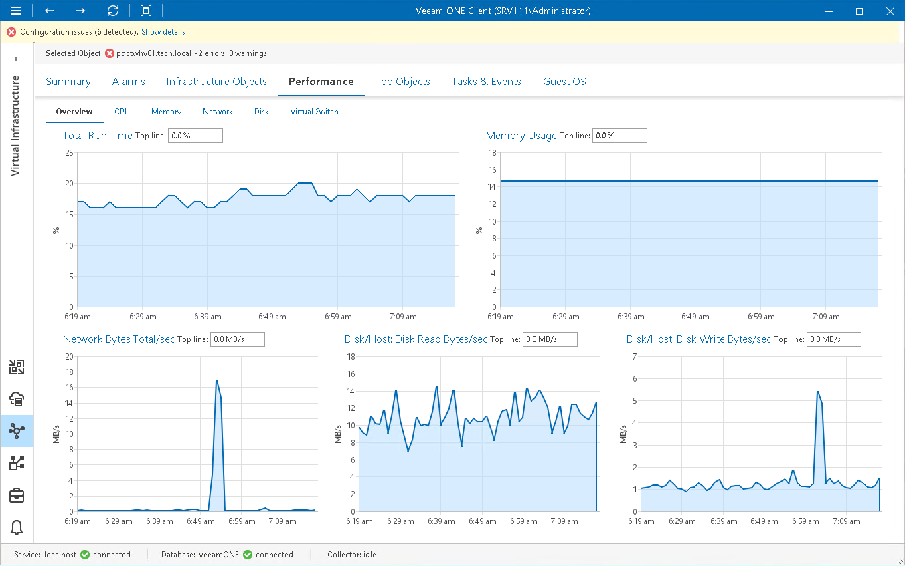

# Overview

The Overview page shows aggregated performance data for the selected virtual infrastructure object or segment: total run time, memory usage, network, disk/host read and write speed. Performance data is shown for the previous 15 minutes.

In the Top line field, you can set a threshold value. The top line is displayed as the red dotted line on the chart to help you monitor whether resource usage exceeds the healthy value range. If you do not need to display the top line, enter '0' (zero) in the Top line field or disable top lines in [Veeam ONE Client chart settings](chart_settings.md). With the top line disabled, the Y-axis will scale automatically to match the range of the displayed data.

To drill down to performance chart details, click the counter link above a performance widget. A corresponding performance chart for the selected virtual infrastructure object will open.

Page updated 2026-08-03

