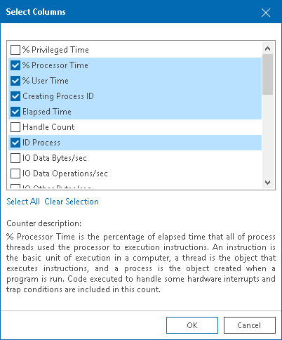

# Microsoft Hyper-V In-Guest Processes

You can view and control processes that are currently running inside a virtual machine or host.

* On Windows-based machines, you can view, end or restart processes.
* On Linux-based machines, you can view or end daemons.

Prerequisites

For Linux-based machines, make sure that the SSH Server is started.

Viewing In-Guest Processes

To view the list of processes:

1. Open Veeam ONE Client.

For details, see [Accessing Veeam ONE Components](access.md).

1. At the bottom of the inventory pane, click Virtual Infrastructure.
2. In the inventory pane, select the necessary infrastructure object.
3. Open the Processes tab.
4. Provide OS authentication credentials (user name and password) to access the list of running processes.

Every process is described with a set of counters that are presented as column headings. You can add or remove counters to monitor running processes:

1. In the upper right corner of the Processes dashboard, click the Select columns link.
2. In the Select Columns window, select check boxes next to counters you want to display.
3. To view a detailed description of a counter, click it in the Counters list, and the description will be displayed in the lower pane of the window.

You can end unwanted processes running on the VM or create an alarm based on the process state or object performance:

* [For Windows-based machines] To end a process, select it in the list and click the Kill Process button, or right-click a necessary process and select Kill Process from the shortcut menu.
* [For Linux-based machines] To end a daemon, select it in the list and click the Kill Process button and choose one of the following options:

* Hangup — to send the SIGHUP signal
* Kill — to send the SIGKILL signal
* Terminate — to send the SIGTERM signal

You can also right-click a necessary process and select Kill Process and choose the necessary option from the shortcut menu.

* [For Windows-based machines] To create an alarm, select one or more processes in the list, click the Create Alarm button, and select the type of rule on which the alarm must be based. For more information, see [Alarm Rules Reference](appendix_rules_alarms.md).

