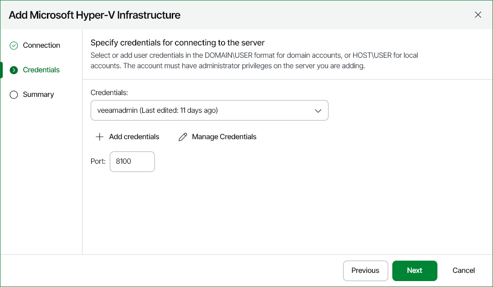

# Step 4. Specify Credentials

At the Credentials step of the wizard:

1. Click Add credentials and specify credentials of the user account for connecting to the server.

For details on adding credentials records, see [Security](credentials_manager.md).

1. [For SCVMM connection] Change the port number if required.

By default, port 8100 is used as the VMM Administrator Console to VMM server port.

|  |
| --- |
| Note |
| VM guest OS credentials are specified in Server Settings. |

For details, see [Step 6. Specify VM Guest OS Credentials](hyperv_guest_credentials.md).

