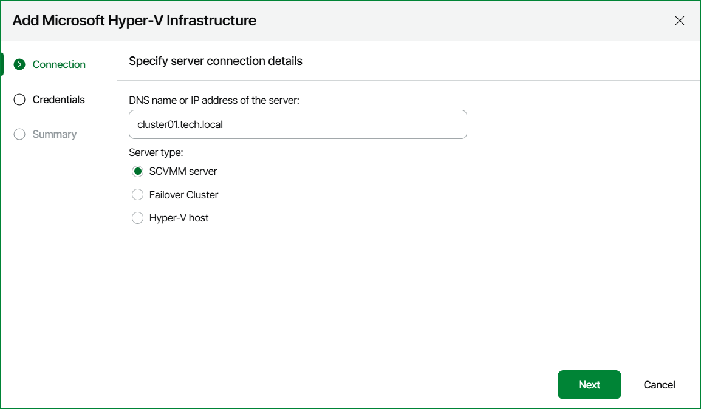

# Step 3. Specify Server Name and Role

At the Connection step of the wizard:

1. Enter DNS name or IP address of the server that will be connected to Veeam ONE.
2. Specify the server type — SCVMM server, failover cluster or standalone host.
3. Specify the port number if other than the default 8100.

Page updated 2026-05-13

