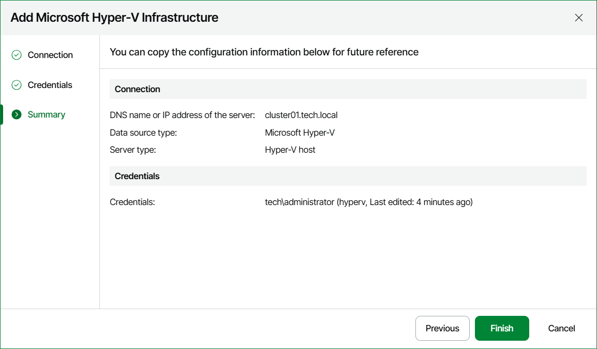

# Step 5. Review Connection Settings

At the Summary step of the wizard, review the connection details and click Finish.

Note that it may take a while for Veeam ONE to collect and display the collected data for the newly added SCVMM server, failover cluster or host and its child objects.

